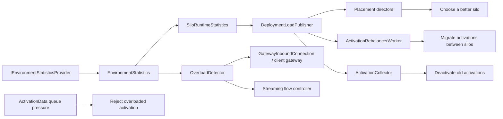
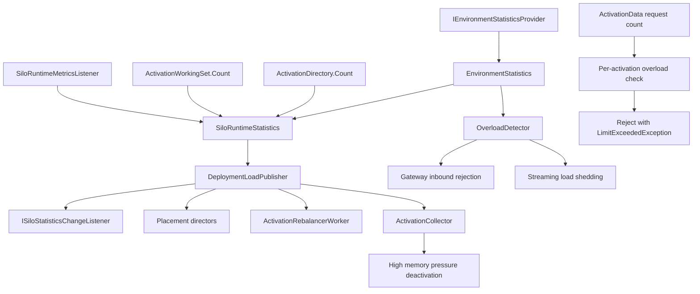

# 资源治理与负载均衡：Orleans 是怎么把统计结果反过来变成调度和放置的（第二十篇）

这篇不把“负载均衡”当成一个单点算法看。Orleans 这块其实是几条控制链叠在一起：

- 先采样：进程里的 CPU、内存、activation 数、消息数、客户端数。
- 再发布：`DeploymentLoadPublisher` 把本地快照广播给集群。
- 再决策：placement director、rebalancer、collector、overload detector 分别吃这份统计。
- 最后下手：拒绝、限流、回收、迁移、换放置点。

我看下来，Orleans 的“资源治理”不是一个统一的调度器，而是多个控制回路共用一套统计。这个设计能跑起来，也确实够灵活，但边界不算干净。统计、放置、限流、迁移、回收，彼此之间靠同一组状态串在一起，耦合比表面上重得多。

## 1. 先把结论摆前面

Orleans 的资源治理，核心不是“算一个全局负载分数”，而是“把统计结果喂给不同的控制点”。

这件事大致分成三层：

- 第一层是观测层：`EnvironmentStatistics` 和 `SiloRuntimeStatistics` 负责把进程状态整理成快照。
- 第二层是控制层：`DeploymentLoadPublisher`、`OverloadDetector`、`ActivationCollector`、placement director、rebalancer 各自读取快照。
- 第三层是动作层：拒绝请求、收缩队列、回收 activation、迁移 activation、换一个 silo 放。

如果只看名字，很容易以为 Orleans 的负载均衡主要在 placement 里。实际上不是。`placement` 只是其中一个出口，真正会“反着影响运行时”的地方很多：

- client gateway 会直接拒绝进来的消息。
- activation 会对自己的待处理请求数做硬限制。
- streaming 会直接把可读量压到 0。
- activation collector 会在高内存压力下主动回收旧 activation。
- rebalancer 会在集群层面迁移 activation。

所以这块最重要的结论其实很简单：**Orleans 不是拿统计做报表，是真的拿统计做控制。**

## 2. 先看整条链路

这条链最好先按“统计从哪来、怎么发出去、谁来消费、消费后做什么”理解。

一条很值得记住的分界线是：

- `DeploymentLoadPublisher` 负责“把统计送出去”。
- `PlacementDirector` 负责“拿统计做选择”。
- `OverloadDetector` 负责“拿统计做拒绝”。
- `ActivationCollector` 负责“拿统计做回收”。
- `ActivationRebalancerWorker` 负责“拿统计做迁移”。

这几个组件都在用统计，但不是同一种用法。

## 3. 统计是怎么被采集并发布的

### 3.1 `EnvironmentStatistics` 是最底层的输入

`IEnvironmentStatisticsProvider` 提供的是进程环境统计，不是 Orleans 自己的业务统计。里面最关键的是 CPU 和内存这几组数据：

- `FilteredCpuUsagePercentage`
- `FilteredMemoryUsageBytes`
- `FilteredAvailableMemoryBytes`
- `MaximumAvailableMemoryBytes`

它们不是只给人看，而是会继续算出几个归一化字段，比如内存占用、可用内存占比。后面的过载判断、placement 打分，很多都直接吃这些值。

### 3.2 `SiloRuntimeStatistics` 是运行时快照

`src/Orleans.Core/Statistics/SiloRuntimeStatistics.cs` 里那份快照，不只是 CPU/内存，还带了这些东西：

- `ActivationCount`
- `RecentlyUsedActivationCount`
- `ClientCount`
- `ReceivedMessages`
- `SentMessages`
- `IsOverloaded`
- `DateTime`
- `EnvironmentStatistics`

这里有个很实在的点：`IsOverloaded` 不是单独算出来的，而是用 `LoadSheddingOptions` 和 `OverloadDetectionLogic` 直接算出来的。也就是说，**同一份快照里既有资源状态，也有“这个 silo 现在是不是该被避开”的结论。**

### 3.3 `DeploymentLoadPublisher` 是统计广播的总出口

`src/Orleans.Runtime/Placement/DeploymentLoadPublisher.cs` 是这条线的核心。

它做的事很直接：

- 每隔一段时间刷新一次统计，默认周期是 1 秒。
- 启动时先随机延迟一下，再开始周期发布，避免所有 silo 同一时刻扎堆。
- 每次发布时，先生成本地的 `SiloRuntimeStatistics`。
- 然后把这份快照发给集群里所有活着的 silo。
- 本地还会保留一份 `ConcurrentDictionary<SiloAddress, SiloRuntimeStatistics>`，给 placement 和 rebalancer 用。

它生成本地统计时，取的是这几样东西：

- `ActivationDirectory.Count`
- `ActivationWorkingSet.Count`
- `IEnvironmentStatisticsProvider`
- `LoadSheddingOptions`

这里很能看出 Orleans 的思路：它不是只看机器资源，也会把 activation 数量和 working set 这些运行时负担一起塞进快照。

`DeploymentLoadPublisher` 还有两个比较关键的行为：

- 只接受新于当前缓存的时间戳，旧数据直接丢掉。
- 如果某个 silo 不是 `Active`，就不接它的统计。

这让它更像一个“最终一致的集群负载缓存”，不是一个强一致目录。

### 3.4 这条链还有诊断出口

`DeploymentLoadPublisherEvents` 会发 `Published`、`Received`、`ClusterRefreshed`、`Removed` 这些事件。这个不是主逻辑，但对排查“统计是不是卡住了”很有用。

## 4. Orleans 怎么用统计反过来影响放置

这里最先要分清一件事：`PlacementService` 本身不是决策器，它只是把调用路由到具体 placement director。真正干活的是各个 director。

### 4.1 `ActivationCountPlacementDirector`：看 activation 数量，走 power-of-k

`src/Orleans.Runtime/Placement/ActivationCountPlacementDirector.cs` 这条线的思路很朴素：

- 先拿到所有兼容的 silo。
- 再随机抽 `ChooseOutOf` 个候选，默认是 2。
- 只在这些候选里比 activation 负载。
- 负载公式是 `ActivationCount + RecentlyUsedActivationCount`。

它还会排除掉已经 overloaded 的 silo。

如果本地还没有统计缓存，它会做两件事：

- 如果本地 silo 兼容，就优先放本地。
- 否则从兼容 silo 里随机挑一个。

这里有个很像“补偿”的小技巧：它在本地缓存里把自己选中的 silo 的 activation count 一次性加上整个集群的 silo 数，而不是只加 1。意思很明显，作者自己也知道统计是有延迟的，多个 silo 同时做放置时，光加 1 不够挡住一波扎堆。

### 4.2 `ResourceOptimizedPlacementDirector`：看资源权重，算一个总分

`src/Orleans.Runtime/Placement/ResourceOptimizedPlacementDirector.cs` 走的是另一条路。

它不是只看 activation 数量，而是给这些指标加权：

- CPU 使用率
- 内存使用率
- 可用内存
- 最大可用内存
- activation 数量

权重来自 `ResourceOptimizedPlacementOptions`，默认值大概是：

- CPU 40
- 内存 20
- 可用内存 20
- 最大可用内存 5
- activation 数量 15
- 本地 silo 偏好边际 5

它的选点方式也挺有意思：

- 先过滤掉 overloaded 的 silo。
- 再从兼容 silo 里取一个大约是平方根大小的候选集。
- 对候选集打分，分低的更好。
- 如果本地 silo 的分数和最优候选差得不多，就偏向本地。

这套逻辑的意思很明确：**资源优化不是绝对追求最小分数，而是允许一点本地偏好。**

### 4.3 `IsOverloaded` 会直接影响放置结果

placement director 看到的不是裸的资源值，而是已经被 `LoadSheddingOptions` 和 `OverloadDetectionLogic` 标过的 `IsOverloaded`。

所以只要一个 silo 被判为 overloaded，placement 这边就会直接绕开它。这个绕开不是“建议”，是硬过滤。

### 4.4 这条线的本质

Orleans 的 placement 不是“算出一个最优全局解”，更像“在当前统计快照上做一个够好的局部选择”。

这也意味着它天然是延迟敏感、最终一致、但不精确的。统计刷新慢一点，placement 就可能晚一点反应；统计刷新快一点，placement 又会更容易抖。

## 5. 过载、拒绝和限流是怎么落下来的

这一块最容易被忽略，但它其实比 placement 更“硬”。

### 5.1 `OverloadDetector`：进程级过载开关

`src/Orleans.Runtime/Messaging/OverloadDetector.cs` 负责判断当前进程是不是 overloaded。

它的判断很简单：

- `LoadSheddingEnabled` 必须先开。
- 然后看 CPU 和内存阈值。
- CPU 超过 `CpuThreshold` 或内存超过 `MemoryThreshold`，就算 overloaded。

这里的阈值来自 `LoadSheddingOptions`，默认值是：

- CPU 95
- 内存 90

`OverloadDetector` 还会做一层缓存，约 1 秒刷新一次，不会每次都去重新算。

### 5.2 `GatewayInboundConnection`：客户端请求会被直接挡回去

`src/Orleans.Runtime/Networking/GatewayInboundConnection.cs` 里，gateway 收到 client 消息后，会先看 `OverloadDetector.IsOverloaded`。

如果已经过载，它不是慢慢排队，而是直接发回 `GatewayTooBusy`。

这是一种很直接的 admission control。意思就是：**进来的流量先别进运行时，门口就挡掉。**

### 5.3 `ActivationData.CheckOverloaded`：单个 activation 也有自己的硬限制

这个地方很重要，因为它说明 Orleans 不只做“集群级”过载，还做“激活级”过载。

`src/Orleans.Runtime/Catalog/ActivationData.cs` 里，`CheckOverloaded()` 会看：

- `SiloMessagingOptions.MaxEnqueuedRequestsHardLimit`
- `SiloMessagingOptions.MaxEnqueuedRequestsSoftLimit`
- 如果是 stateless worker，还会切到对应的 worker 版本

判断方式也很直接：

- `GetRequestCount()` 统计的是 `running + waiting`
- 超过 hard limit，就返回 `LimitExceededException`
- 超过 soft limit，只打警告，不立刻拒绝

最后真正触发拒绝的地方，是 `ReceiveRequest(Message)` 进来时会先跑这一步。

这就是你说的“activation/work item 压力”最直接的落点：**不是等系统整体过热，而是单个 activation 自己先顶不住的时候就拒绝。**

### 5.4 streaming 也有自己的限流器

`src/Orleans.Streaming/LoadShedQueueFlowController.cs` 是另一条线。

它不是做细粒度调节，而是一个很粗暴的开关：

- 过载时返回 `0`
- 不过载时返回 `int.MaxValue`

也就是说，streaming 这边的 flow control 更像“要么放行，要么不收”。

它吃的还是 `LoadSheddingOptions` 和 `IEnvironmentStatisticsProvider`。同一套过载判断，在 gateway、streaming、silo runtime 里都会出现，但语义又不完全一样。

## 6. activation 压力和内存压力，是两回事

这一点最好单独说，不然很容易混。

### 6.1 activation 压力是“队列太长”

`ActivationData` 里维护了两组东西：

- `_waitingRequests`
- `_runningRequests`

`GetRequestCount()` 直接把这两项加起来。这个数一旦超过 hard limit，activation 就直接拒绝新的请求。

这解决的是“这个 activation 忙不过来”的问题。

### 6.2 内存压力是“进程快撑不住了”

`src/Orleans.Runtime/Catalog/ActivationCollector.cs` 处理的是另一种压力。

它不是看单个 activation 的队列，而是看整个进程的内存占用。`IsMemoryOverloaded()` 会拿当前 `NormalizedMemoryUsage` 跟 `MemoryUsageLimitPercentage` 比较。

默认配置在 `GrainCollectionOptions` 里：

- `EnableActivationSheddingOnMemoryPressure`
- `MemoryUsagePollingPeriod`
- `MemoryUsageLimitPercentage`
- `MemoryUsageTargetPercentage`

如果超过上限，collector 不会只是提醒，它会算出该回收多少个 activation，尽量把内存打回目标值附近。

### 6.3 `RunMemoryBasedDeactivationLoop` 会等 GC，再动手

`ActivationCollector` 的内存回收循环有个很实在的限制：

- 先等 Gen2 GC。
- 还要确认上一轮之后真的发生过新的 Gen2 GC。
- 只有确认过了，才会去做内存压力驱动的回收。

这说明它并不是见到高内存就立刻猛收，而是想先让 GC 先做一轮，再决定是否需要继续回收 activation。

### 6.4 它回收的是旧的 activation，不是迁移

这里也要分清：`ActivationCollector` 干的是回收，不是负载均衡。

它的目标是减少本地压力，不是把 activation 搬到别的 silo。

所以这条链和 placement、rebalancer 不是一回事，但它们都在消费统计，也都在影响运行时形态。

## 7. 集群负载均衡和迁移，是怎么被统计驱动的

### 7.1 `ActivationRebalancerWorker`：真正做迁移的那条线

`src/Orleans.Runtime/Placement/Rebalancing/ActivationRebalancerWorker.cs` 是集群层的自适应迁移器。

它订阅 `DeploymentLoadPublisher` 的统计变化，然后维护自己的集群状态，最后按 session 去做迁移。

它的几个动作很清楚：

- 定时发监控报告。
- 定时触发 rebalancing session。
- 根据 entropy / imbalance 决定要不要继续。
- 通过 `IActivationMigrationManager` 去迁移 activation。
- 把状态做 dehydration / rehydration，避免重启后完全丢失上下文。

`ActivationRebalancerOptions` 里几项关键配置也很明显：

- `RebalancerDueTime`
- `SessionCyclePeriod`
- `MaxStagnantCycles`
- `EntropyQuantum`
- `AllowedEntropyDeviation`
- `ScaleAllowedEntropyDeviation`
- `ActivationMigrationCountLimit`

有个约束很值得注意：`SessionCyclePeriod` 不能小于 `2 x DeploymentLoadPublisherRefreshTime`。这说明 rebalancer 的节奏必须比统计刷新慢，不然它只会追着旧数据跑。

### 7.2 `ActivationRebalancerMonitor`：rebalancer 的宿主看门人

`src/Orleans.Runtime/Placement/Rebalancing/ActivationRebalancerMonitor.cs` 是 monitor。

它不负责迁移本身，主要负责：

- 定时向 worker 要报告。
- 缓存最新报告。
- 当宿主 silo 要停时，把 rebalancer worker 迁走。

它和 worker 的关系有点像“看门人 + 干活的人”。worker 才是实际操作集群平衡的主体，monitor 负责盯着别让它掉线。

### 7.3 `ActivationRepartitioner`：这不是负载均衡，是通信局部性重分配

`src/Orleans.Runtime/Placement/Repartitioning/ActivationRepartitioner.cs` 很容易和 rebalancer 看混，但它其实是另一条线。

它看的不是 CPU 或内存，而是 message edge，也就是 grain 和 grain 之间的通信关系。

这条链大概是：

- `IMessageStatisticsSink` 收消息统计。
- `ActivationRepartitioner` 聚合 edge。
- `RepartitionerMessageFilter` 过滤掉 self-call 和不能迁移的 grain。
- `IImbalanceToleranceRule` 决定当前偏差是否已经值得交换。

它的目标不是“谁更闲就放谁”，而是“谁跟谁通信多，就尽量放近一点”。

这个名字很容易误导人。`rebalancer` 是负载平衡，`repartitioner` 是通信局部性优化。两条线都在迁移 activation，但依据完全不同。

### 7.4 这块的配置和默认装配

`DefaultSiloServices` 里默认只装了一个 `NoOpMessageStatisticsSink`。

如果你显式调用：

- `AddActivationRebalancer()`
- `AddActivationRepartitioner()`

才会把对应组件挂上去。

这也说明了一件事：Orleans 的自适应迁移不是所有场景都默认开，它是可选的、分层的。

## 8. 默认服务里，Orleans 是怎么把这些东西拼起来的

`src/Orleans.Runtime/Hosting/DefaultSiloServices.cs` 里能看出 Orleans 自己的默认控制平面是怎么组的：

- `OverloadDetector`
- `ActivationCollector`
- `DeploymentLoadPublisher`
- `PlacementService`
- `ActivationCountPlacementDirector`
- `ResourceOptimizedPlacementDirector`
- `IMessageStatisticsSink` 的默认空实现

这几项放在一起，其实已经说明了 runtime 的默认形态：

- 先有统计。
- 再有局部拒绝。
- 再有 placement。
- 再有回收。

真正的“迁移式优化”是另开扩展挂上去的，不在最基本的默认路径里。

## 9. 这块里我觉得不够干净的地方

### 9.1 一份统计喂了太多东西

`SiloRuntimeStatistics` 既给 placement 用，也给 rebalancer 用，还和 overload 判断绑在一起。理论上这能省事，实际上边界有点糊。

同一份快照里同时装了：

- 资源状态
- activation 数量
- 消息计数
- overload 结论

这会让后面每个消费者都带上一部分“它本不该知道的东西”。

### 9.2 阈值分散，语义也不完全一样

看上去都是“过载”，其实很多地方不是一个语义：

- gateway 关门，是为了不让新请求进来。
- activation 拒绝，是为了保护单个 activation。
- streaming 限流，是为了压低队列读速率。
- collector 回收，是为了给进程减压。

这些都用了“负载”这个词，但实现上是几套逻辑。名字相近，行为不一样，后面很容易看晕。

### 9.3 rebalancer 和 repartitioner 的命名会误导人

一个是按资源和熵做 cluster balance，一个是按 message edge 做 locality repartition。功能差得挺远，但都叫“重平衡/重分区”一类的名字，第一次看源码很容易绕进去。

### 9.4 统计是最终一致的，控制动作却是即时的

`DeploymentLoadPublisher` 每秒刷新一次，placement 读到的很可能是上一轮或者上两轮的快照。

这意味着：

- placement 会有延迟。
- rebalancer 会有滞后。
- 多个 silo 可能基于同一份旧快照同时做决定。

Orleans 用了一些补偿办法，比如局部缓存、随机化、候选集抽样，但它本质上还是一套最终一致的控制系统。

### 9.5 `ActivationData` 里东西还是太多

单个 activation 既要管执行队列，又要管 lifecycle，又要管拒绝，又要管调度，还要管一些迁移和诊断相关的细节。

资源压力最先落到这里的时候，复杂度会特别明显。

## 10. 如果我来复刻，我会怎么拆

如果是自己复刻一版，我不会直接把这些逻辑揉成一个“大调度器”，那样后面肯定更乱。

我会拆成四个层次：

### 10.1 先有一层统一的负载快照

快照只负责收集和发布，不做决策。

这层里可以包含：

- CPU / memory
- activation count
- queue depth
- client count
- message count
- overload flag

但是不要把 placement 规则塞进去。

### 10.2 再有一层 admission control

这一层只回答一个问题：现在还能不能接新工作。

它负责：

- gateway 拒绝
- activation 队列硬限制
- streaming 限流

这层应该尽量简单、短路、可预测。

### 10.3 再有一层 placement policy

placement policy 只做“去哪儿”的选择。

可以有不同策略：

- 只看 activation count
- 资源加权
- 本地优先
- 冷热分层

但它不该直接去管回收，也不该直接去管迁移 session。

### 10.4 最后再有一层 migration controller

迁移控制器只负责“要不要动、动多少、动到哪”。

如果要做两条迁移线，我会明确拆开：

- 一条是资源驱动的 balancing。
- 一条是通信局部性驱动的 repartitioning。

不要把这两条线混成一个策略对象。

## 11. 推荐阅读顺序

如果你想把这条线从头到尾吃透，我建议按这个顺序看：

1. `src/Orleans.Core.Abstractions/Statistics/IEnvironmentStatisticsProvider.cs`
2. `src/Orleans.Core/Statistics/SiloRuntimeStatistics.cs`
3. `src/Orleans.Runtime/Placement/DeploymentLoadPublisher.cs`
4. `src/Orleans.Runtime/Messaging/OverloadDetector.cs`
5. `src/Orleans.Core/Messaging/OverloadDetectionLogic.cs`
6. `src/Orleans.Runtime/Networking/GatewayInboundConnection.cs`
7. `src/Orleans.Runtime/Catalog/ActivationData.cs`
8. `src/Orleans.Runtime/Catalog/ActivationCollector.cs`
9. `src/Orleans.Runtime/Placement/ActivationCountPlacementDirector.cs`
10. `src/Orleans.Runtime/Placement/ResourceOptimizedPlacementDirector.cs`
11. `src/Orleans.Runtime/Placement/Rebalancing/ActivationRebalancerWorker.cs`
12. `src/Orleans.Runtime/Placement/Rebalancing/ActivationRebalancerMonitor.cs`
13. `src/Orleans.Runtime/Placement/Repartitioning/ActivationRepartitioner.cs`
14. `src/Orleans.Streaming/LoadShedQueueFlowController.cs`
15. `src/Orleans.Runtime/Hosting/DefaultSiloServices.cs`

如果只想先抓主干，前三个文件和 `ActivationData`、`ActivationCollector` 先看就够了。

## 12. 这一篇的落点

Orleans 这套资源治理，真正有意思的地方不在“有没有负载均衡”，而在它怎么把统计变成动作。

它会：

- 用统计决定放哪里。
- 用统计决定先不先接。
- 用统计决定要不要回收。
- 用统计决定要不要迁移。

这也是 Orleans 架构里比较别扭、但也最真实的一块：统计和控制绑得很紧，紧到你很难把它们完全拆开。
