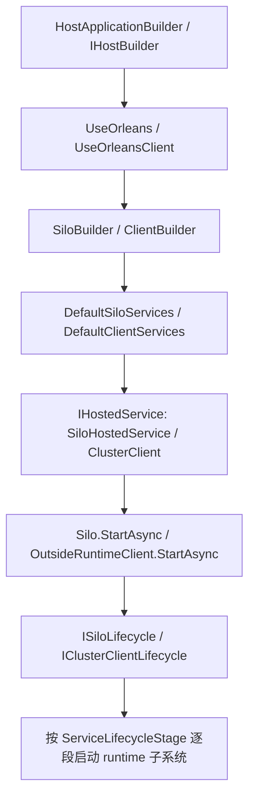

# 部署与宿主启动链：`UseOrleans`、默认服务注册和 lifecycle stage 是怎么把 runtime 拉起来的（第二十一篇）

## 先说结论

Orleans 的宿主层不是“顺手把 runtime 启一下”，而是整个系统的组合根。`UseOrleans` / `UseOrleansClient` 负责把 `HostBuilder`、`Configuration`、`IServiceCollection`、默认实现、配置绑定和生命周期阶段全部串起来，最后把前面那些 runtime 子系统真正拉起。

这里最关键的一点是：`IHostedService` 只是外壳，真正决定启动顺序的是 Orleans 自己的生命周期图。宿主层负责把对象都注册进去，`Silo` 和 `ClusterClient` 再按阶段把目录、网络、成员管理、调度、消息中心、持久化、启动任务这些东西依次点亮。

## 一条主链

这条链如果翻成人话，就是：

1. 宿主先把 Orleans builder 挂到 `Host` 上。
2. builder 构造时就把默认服务装进去。
3. 默认服务里注册了真正的 `IHostedService`。
4. `Host.StartAsync` 触发 hosted service。
5. hosted service 再触发 Orleans 自己的 lifecycle。
6. lifecycle 按阶段把 runtime 一个个拉起来。

## Host 到 Builder

`src/Orleans.Runtime/Hosting/OrleansSiloGenericHostExtensions.cs` 里的 `UseOrleans(...)` 是 silo 的入口，`src/Orleans.Core/Hosting/OrleansClientGenericHostExtensions.cs` 里的 `UseOrleansClient(...)` 是 client 的入口。

这两套入口都做了同一件事：

- 把 `Configuration` 传给 Orleans builder。
- 把 `IServiceCollection` 交给默认服务注册。
- 用一个 `OrleansBuilderMarker` 避免同一个 host 被重复装配。
- 明确禁止 `UseOrleans` 和 `UseOrleansClient` 混着用。

这里其实已经暴露出 Orleans 的部署语义了：如果你要在同一个进程里同时跑 client 和 server，`UseOrleans` 就够了，因为 silo 本身已经把一个 hosted client 一起带上了。

## 默认装配

`src/Orleans.Runtime/Hosting/SiloBuilder.cs` 和 `src/Orleans.Core/Core/ClientBuilder.cs` 的构造函数都很短，核心动作只有一个：调用 `DefaultSiloServices.AddDefaultServices(...)` 或 `DefaultClientServices.AddDefaultServices(...)`。

这两个默认装配器是 Orleans 宿主层真正的“大中枢”：

- `DefaultSiloServices` 注册 `Silo`、`SiloHostedService`、`SiloLifecycleSubject`、`ServiceLifecycle<ISiloLifecycle>`、`MessageCenter`、`InsideRuntimeClient`、`MembershipAgent`、`ClusterMembershipService`、`PlacementService`、`LocalGrainDirectory`、`CachedGrainLocator`、`ActivationCollector`、`ActivationWorkingSet`、`DeploymentLoadPublisher`、网络监听器等。
- `DefaultClientServices` 注册 `ClusterClient`、`OutsideRuntimeClient`、`ClientMessageCenter`、`GatewayManager`、`ConnectionManager`、`ServiceLifecycle<IClusterClientLifecycle>` 等。

它们不只是“默认实现清单”，还顺手把：

- 日志、Options、Metrics
- 序列化、拷贝器、类型名过滤器
- 配置验证器
- provider runtime
- 健康检查、统计、活动传播

全都一起接好了。

## 生命周期怎么跑

Orleans 不是靠宿主的启动顺序硬排的，而是靠自己的 stage 图。

`src/Orleans.Core/Lifecycle/ServiceLifecycleStage.cs` 里把阶段切得很细，典型顺序是：

- `RuntimeInitialize`
- `RuntimeServices`
- `RuntimeStorageServices`
- `RuntimeGrainServices`
- `AfterRuntimeGrainServices`
- `ApplicationServices`
- `BecomeActive`
- `Active`

`src/Orleans.Runtime/Silo/Silo.cs` 里，`Silo` 自己订阅了这些关键阶段：

- `RuntimeInitialize`：先把 silo 状态切到 `Starting`
- `RuntimeServices`：开始阻断/整理一部分运行时消息路径
- `RuntimeGrainServices`：初始化 grain service，启动 watchdog
- `BecomeActive`：把 `SystemStatus` 切成 `Running`
- `Active`：最后把 grain service 真正跑起来

停止顺序也在同一条 lifecycle 上，只是反过来：

- 先停业务流量
- 再停 activation / membership / gateway 相关路径
- 最后关消息中心和终止信号

`src/Orleans.Core/Lifecycle/ServiceLifecycle.cs` 另外再包了一层服务生命周期，把 `Started`、`Stopping`、`Stopped` 这三个阶段映射到 `ISiloLifecycle` 或 `IClusterClientLifecycle` 上。它本质上是给外部组件一个更好用的观察口，但真正的启动顺序还是由 Orleans lifecycle 决定。

`src/Orleans.Runtime/Lifecycle/SiloLifecycleSubject.cs` 负责把 stage 名字、耗时、observer 结果都记下来。它不是业务逻辑本身，而是把 lifecycle 这张图变得可见。

## Client 侧怎么起

client 这边的外壳是 `src/Orleans.Core/Core/ClusterClient.cs`。

它的启动顺序很直白：

1. 先让 `OutsideRuntimeClient.StartAsync(...)` 起来。
2. 再让 `ClusterClientLifecycle.OnStart(...)` 跑起来。

停止时则反过来：

1. 先停 client lifecycle。
2. 再停 runtime client。

这意味着 client 并不是“一个轻量 RPC 外壳”而已，它也有自己的生命周期、参与者和连接管理，只是比 silo 少了一大截后台子系统。

## 配置绑定

Orleans 的宿主配置主要落在 `Orleans` 这个配置节里。

`DefaultClientServices` 会绑定：

- `ClusterOptions`
- `ClientMessagingOptions`
- `GatewayOptions`

`DefaultSiloServices` 会绑定更多：

- `SiloOptions`
- `SchedulingOptions`
- `EndpointOptions`
- `SiloMessagingOptions`
- `ClusterMembershipOptions`
- `GrainDirectoryOptions`
- `ActivationCountBasedPlacementOptions`
- `ResourceOptimizedPlacementOptions`
- `GrainCollectionOptions`
- `StatelessWorkerOptions`
- `GrainVersioningOptions`
- `ConsistentRingOptions`
- `LoadSheddingOptions`

这套绑定不是单纯读配置，而是“默认值 + 后置补齐 + 验证器”一起上。

`src/Orleans.Core/Configuration/Options/ClusterOptions.cs` 里默认 `ClusterId` 和 `ServiceId` 都是 `"default"`，但验证器要求最终值不能为空。也就是说，默认值只是给你兜底，真正上线时还是得把身份配置完整。

开发场景下，`UseLocalhostClustering(...)` 会把 endpoint、cluster id、service id 一起兜住；如果调用方没显式覆盖，就会后置成 `dev`。这类逻辑在 client 和 silo 两边都存在，但客户端用的是静态 gateway 列表，silo 用的是 development clustering 方案。

`UseDevelopmentClustering(...)` 则把开发环境下的 membership table 和 system target 直接接进来，这也是 Orleans 里最明显的“本地开发模式”。

## 部署模型

从宿主层看，Orleans 主要有几种部署姿势：

- 单独 silo：只跑 `UseOrleans`。
- 单独 client：只跑 `UseOrleansClient`。
- 同进程 client + server：只跑 `UseOrleans`，因为 silo 已经包含 hosted client。
- 本地开发集群：`UseLocalhostClustering` / `UseDevelopmentClustering`。
- 生产集群：靠配置里的 `ClusterId`、`ServiceId`、gateway、membership provider、directory provider 等把集群拼起来。

这里的重点不是“选哪个 API”，而是 Orleans 把“部署模式”直接写进了宿主装配过程。换句话说，部署不是一个独立层，而是 host composition 的一部分。

## 为什么说宿主层很重

我觉得 Orleans 宿主层最大的架构问题，不是功能不够，而是职责太集中。

- `DefaultSiloServices` / `DefaultClientServices` 都太大了，几乎是 runtime 子系统的总开关。
- 启动顺序并不靠一个清晰的 bootstrap pipeline，而是分散在 `IHostedService`、`ISiloLifecycle`、`IClusterClientLifecycle`、`IServiceLifecycle` 里。
- 配置绑定、默认值、验证器、provider 发现、生命周期注册混在一起，读起来不够直。
- `OrleansBuilderMarker` 这种“防重复装配”的做法能工作，但也说明 builder/host 的边界并不轻。
- `UseOrleans` 自动包含 client，说明同进程部署语义是框死的，不是靠显式组合出来的。

## 复刻建议

如果是重新复刻一版，我会把宿主层拆得更显式一点：

1. 先有一个很薄的 `HostBootstrap`，只负责把配置、日志和默认服务入口接起来。
2. 再有一个明确的 runtime composition graph，把目录、网络、membership、调度、消息、storage 分成几个可见阶段。
3. 把 dev / localhost / production 三种部署模式分开，不要靠一堆 `PostConfigure` 去补。
4. 把 lifecycle stage 作为一等公民暴露出来，不要让“谁先起谁后起”藏在 DI 注册顺序里。
5. client 和 silo 的 host 模型要分开，只有同进程模式才允许显式合并。

这篇只是开头，但它其实已经把 Orleans 的宿主真相说出来了：runtime 不是自己长出来的，是 host 层用一大串默认装配和生命周期阶段，一层层推上去的。
