# 管理面与 SystemTarget：ManagementGrain、系统消息和内部控制路径是怎么串起来的（第二十四篇）

## 先说结论
Orleans 的管理面，表面上看是一个 `ManagementGrain`，实际上背后跑的是一组内部 `SystemTarget`。`ManagementGrain` 负责对外提供管理 API，真正干活的是每个 silo 上的 `SiloControl`、`MembershipSystemTarget`、`RemoteGrainDirectory`、`ActivationMigrationManager` 这类系统目标。

这条链路最关键的点有三个。

第一，`SystemTarget` 不是普通 grain。它不是靠 catalog 现配现起的，地址里直接带目标 silo，消息也会被打上系统消息标记，运行时会走一套更硬的内部路径。

第二，管理面和普通 grain 调用不是一回事。普通 grain 调用要先做放置，再找 activation，再进 catalog；管理面很多命令直接绕过普通放置路径，转成对某个 silo 的内部控制调用。

第三，Orleans 把“系统控制”和“业务调用”混在了同一套消息和调度框架里，只是靠 `SystemTarget`、`IsSystemMessage`、特殊 `GrainId` 和大量分支把它们区分开。这么做很省事，但也把内部控制面写成了很多隐式规则。

## 一条主链先看懂
先把最常见的管理请求串一下。

```mermaid
flowchart LR
    A["外部调用 IManagementGrain"] --> B["ManagementGrain"]
    B --> C["按 silo 取 ISiloControl"]
    C --> D["GrainFactory.GetSystemTarget"]
    D --> E["SystemTargetGrainId"]
    E --> F["目标 silo 上的 SiloControl / 其他 SystemTarget"]
    F --> G["SystemTarget.ReceiveMessage"]
    G --> H["WorkItemGroup / TaskScheduler"]
    H --> I["执行控制命令"]
    I --> J["返回结果"]
```

如果是普通 grain 调用，链路会更长：先走 placement，再走目录和 activation，最后才进目标 grain 的执行队列。管理面调用往往不是这么走，它更像是“拿到某个 silo 的内部控制句柄，然后直接下命令”。

## 先把角色分清
### `ManagementGrain`
`ManagementGrain` 是对外的管理入口，它本身是一个普通 grain，不是 `SystemTarget`。它的定位很像管理控制台的后端：接住请求，拆成一组针对具体 silo 的内部调用，再把结果拼回来。

它处理的事情包括：

- 看集群里有哪些 silo
- 触发垃圾回收
- 触发 activation 回收
- 拉运行时统计
- 拉 grain 统计和 activation 统计
- 查询某个 grain 的 activation 地址
- 查当前活跃 grain
- 下发 provider 控制命令
- 调整版本兼容策略和选择策略

### `SystemTarget`
`SystemTarget` 是 Orleans 运行时内部的“系统 actor”。它看起来像 grain，实际上是 runtime 自己维护的对象。

它有几个很明显的特征：

- 它的地址是确定的，通常会把目标 silo 编进 `GrainId`
- 它不是通过普通 activation 创建流程出来的
- 它自己带 `WorkItemGroup`，消息进来后直接排队执行
- 它可以注册 timer，也可以拿 extension
- 它常常实现一组内部接口，比如 `ISiloControl`、`IMembershipService`、`IRemoteGrainDirectory`

### `SiloControl`
`SiloControl` 是最典型的内部控制目标。`ManagementGrain` 要做的很多事，最后都会落到它身上。

它不是对外 API，而是每个 silo 上的控制执行面。可以把它理解成：`ManagementGrain` 是总入口，`SiloControl` 是真正在目标 silo 上执行命令的那个人。

## `SystemTarget` 到底怎么被找到
系统目标的地址不是靠普通 grain 的那套放置和目录逻辑算出来的，而是直接用 `SystemTargetGrainId` 编出来。

`SystemTargetGrainId` 里会把目标 silo 地址编码进 key 里，所以只要拿到这个 grain id，运行时就知道你想打到哪个 silo。这个设计很直白，也很硬。

`GrainFactory.GetSystemTarget<T>()` 做的事情就是：

- 用 `SystemTargetGrainId` 造出目标 id
- 用这个 id 拿一个 typed reference
- 缓存起来，避免每次都重新造代理

也就是说，系统目标虽然不是普通 grain，但 Orleans 还是沿用了同一套“先拿引用，再发消息”的模型。区别在于，这个引用不是给业务用的，而是给 runtime 自己用的。

## 系统消息是怎么回事
Orleans 里所谓“系统消息”，不是另一套协议，而是 `Message` 上的一个标记。

当 `InsideRuntimeClient` 发现目标是 `SystemTarget` 时，它会把这次请求标成系统消息，同时把目标 silo 填进去。这样后面的消息中心、网关、路由和拒绝逻辑就能识别出这不是普通业务请求。

这件事很关键，因为它决定了很多特殊分支。

- 系统消息可以在关机路径里继续走
- 系统消息可能绕过普通 application message 的限制
- 系统消息在网关转发时会改写目标 grain id 和目标 silo
- 系统消息找不到目标时，处理方式和普通 grain 不一样

所以这里真正的差别，不是“另起一套消息类型”，而是“同一个消息对象，带上不同的语义位，运行时到处分支判断”。

## 管理面命令的真实执行路径
`ManagementGrain` 的典型写法是：先拿集群状态，再按 silo 创建对应的 `ISiloControl` 系统目标引用，然后逐个调用。

像这些命令都属于这一路：

- `ForceGarbageCollection`
- `ForceActivationCollection`
- `ForceRuntimeStatisticsCollection`
- `GetRuntimeStatistics`
- `GetGrainActivationCount`
- `GetTotalActivationCount`
- `GetActiveGrains`
- `SendControlCommandToProvider`

这里的重点不是“管理面能做什么”，而是“它不是直接操作本地数据结构，而是转成对远端 silo 的系统目标调用”。

这就带来一个很 Orleans 的味道：对外看起来是一个管理 API，对内其实是把请求拆成很多 actor 间调用。

## `SiloControl` 为什么是管理面的核心
`SiloControl` 是 `SystemTarget`，所以它天然就带着运行时内部控制面的属性。

它负责的事情有几类：

- 直接返回运行时和 grain 统计
- 对本 silo 做 GC 和 activation collection
- 查询本 silo 的活跃 grain
- 执行 provider 级别的控制命令
- 调整版本策略
- 做迁移相关操作

它和普通 grain 的区别，不只是“名字里带 control”。更重要的是它挂在 runtime 内部，和 activation catalog、directory、统计器、负载控制器这些组件直接对接。

你可以把它看成：管理面 API 的执行引擎。

## silo 之间的 SystemTarget 通信
这个点很值得单独看，因为它解释了 Orleans 为什么能在同一套消息系统里做很多内部协调。

常见的内部系统目标通信有几种：

- `MembershipSystemTarget` 用来做成员状态和探测
- `RemoteGrainDirectory` 用来代理远端目录
- `ActivationMigrationManager` 用来协调 activation 迁移
- `SiloControl` 用来接管理命令

它们的共同点是：

- 都是 `SystemTarget`
- 都通过 `GrainFactory.GetSystemTarget` 拿引用
- 都会把目标 silo 编进 id
- 都会走系统消息路径

这意味着 silo 之间的内部协作，并不是“偷偷调用一个服务接口”，而是照样发消息，只是发的是 runtime 认得的系统消息。

## 普通 grain 调用和管理面调用差在哪
这块最好直接对比。

普通 grain 调用的主路径是：

- 先拿 grain reference
- 再走 placement
- 再找 activation
- 再进入 catalog 和 activation 队列
- 再执行用户方法

管理面或系统目标调用的主路径更像是：

- 先把目标 silo 算出来
- 再造 system target reference
- 再发系统消息
- 再直接进目标 `SystemTarget` 的队列

所以两者最大的差别，不是“一个叫管理，一个叫业务”，而是 runtime 对它们的路由和生命周期假设完全不同。

普通 grain 假设：

- 目标 activation 可能要创建
- 目标可能迁移
- 目标可能不存在
- 需要依赖 placement 和 directory

系统目标假设：

- 目标 silo 是明确的
- 目标对象是 runtime 先天就有的
- 不需要普通 activation 创建流程
- 更多是内部控制和协调

## 运行时内部控制路径里有哪些关键分叉
### `Catalog` 会把系统目标排除在普通 activation 创建外
普通 grain 的 activation 是 catalog 管的，但系统目标不是这么进来的。`Catalog.GetOrCreateActivation` 对系统目标会直接走特殊处理，不会像普通 grain 那样按需创建一个 activation。

这个设计说明了一件事：`SystemTarget` 是 runtime 的“预置控制对象”，不是用户 grain 那种“请求来了再起”的对象。

### `MessageCenter` 会对系统消息放行
消息中心在收发消息时，会专门识别系统消息。

这会影响：

- 关机时是否允许发送
- 找不到目标时如何拒绝
- 本地回环还是远端发送
- response 的处理方式

换句话说，`MessageCenter` 不是纯传输层，它带着很重的 runtime 语义。

### `Gateway` 会改写系统目标消息
网关里对系统目标也有特殊处理。它不是简单把消息转发出去，而是会根据目标 system target 的地址改写 `TargetGrain` 和 `TargetSilo`。

这说明系统目标消息在跨 silo 传递时，目标定位信息不是固定死的，而是会被 runtime 按路由语义重写。

## 这套设计里最“Orleans”的地方
我觉得有三个特别典型。

第一，控制面和业务面共享同一套消息框架。这样 runtime 复用得很彻底，但边界就会变软。

第二，系统目标不是独立控制通道，而是伪装成 grain reference。这样上层 API 很统一，但内部要堆不少特判。

第三，管理面不是一个纯 HTTP 或 RPC 管理服务，而是一个 grain + system target 的混合体。它很灵活，也很像 Orleans 一贯的做法：尽量把一切都塞进 actor 模型里。

## 我觉得不够干净的地方
这部分不是批评功能，而是从复刻角度看，哪些地方最容易把架构做脏。

### 第一，系统目标和普通 grain 共享太多语义
`SystemTarget` 仍然有 reference、timer、scheduler、call cancellation 这些和普通 grain 很像的能力。统一是统一了，但边界也被冲淡了。

### 第二，系统消息只是 flag，不是独立协议
它非常省，但也意味着很多代码要记得看 `IsSystemMessage`，一旦漏掉分支，行为就会不对。

### 第三，控制面分布得太散
`ManagementGrain`、`SiloControl`、`MembershipSystemTarget`、`RemoteGrainDirectory`、`ActivationMigrationManager` 都在做控制相关的事，但它们的职责边界并不总是特别清爽。

### 第四，很多内部目标都靠常量和约定串起来
目标类型、系统 grain type、地址编码、silo 绑定，都依赖一堆硬编码约定。它能跑，但可读性和可扩展性一般。

## 如果要复刻，我会怎么拆
如果你要完整复刻一版，我建议把这条线拆成四层。

### 第 1 层：内部目标地址层
先把 `SystemTargetGrainId` 这一套做出来。

- 目标 silo 怎么编码
- 系统目标 type 怎么标识
- `GetSystemTarget` 怎么造 reference

### 第 2 层：消息语义层
再把系统消息的 flag 和路由规则补齐。

- 什么情况下标系统消息
- 怎么绕过普通 application message 限制
- 找不到目标时怎么拒绝
- 网关要不要改写目标 id

### 第 3 层：控制面对象层
然后做 `ManagementGrain` 和 `SiloControl` 的双层结构。

- 对外一个管理入口
- 对内每个 silo 一个控制目标
- 命令尽量做成 fan-out

### 第 4 层：其他系统目标
最后补上 membership、directory、迁移、统计这类系统目标。

- 它们都应该是 runtime 内部 actor
- 它们之间也应该能互相发系统消息
- 它们不要走普通 grain 的 activation 创建路径

## 推荐阅读顺序
如果你想顺着源码把这条线完整吃透，我建议这样读。

- `src/Orleans.Core/SystemTargetInterfaces/IManagementGrain.cs`
- `src/Orleans.Runtime/Core/ManagementGrain.cs`
- `src/Orleans.Core/SystemTargetInterfaces/ISiloControl.cs`
- `src/Orleans.Runtime/Silo/SiloControl.cs`
- `src/Orleans.Runtime/Core/SystemTarget.cs`
- `src/Orleans.Core.Abstractions/IDs/SystemTargetGrainId.cs`
- `src/Orleans.Runtime/Core/InsideRuntimeClient.cs`
- `src/Orleans.Runtime/Messaging/MessageCenter.cs`
- `src/Orleans.Runtime/Messaging/Gateway.cs`
- `src/Orleans.Runtime/Networking/GatewayInboundConnection.cs`
- `src/Orleans.Runtime/Catalog/Catalog.cs`
- `src/Orleans.Core/Runtime/Constants.cs`
- `src/Orleans.Runtime/MembershipService/MembershipSystemTarget.cs`
- `src/Orleans.Runtime/Catalog/ActivationMigrationManager.cs`
- `src/Orleans.Runtime/GrainDirectory/RemoteGrainDirectory.cs`

## 最后一句
如果把 Orleans 的管理面看成“一个普通管理服务”，你会低估它；如果把它看成“运行时内部的一组系统 actor”，你才会真正看见它的结构。

这篇文档就是先把这件事说清楚：`ManagementGrain` 只是入口，`SystemTarget` 才是内部控制面的底座。
