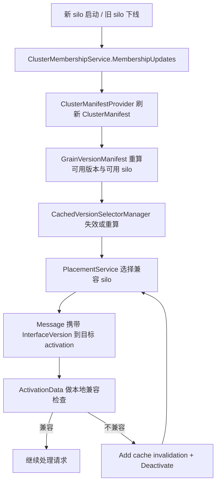

# 跨版本升级与 Rolling Upgrade 实操链：版本选择、兼容 director 和旧新 activation 共存（第二十五篇）

## 先说结论

Orleans 的 rolling upgrade 不是“把旧节点换成新节点”这么简单，而是一整套版本协商链：

- 集群成员变化后，`ClusterManifestProvider` 会刷新 cluster manifest。
- `GrainVersionManifest` 会据此重算“现在有哪些版本、哪些 silo 还活着”。
- `VersionSelectorManager` 和 `CompatibilityDirectorManager` 会一起决定“该把请求发给哪个版本”。
- `PlacementService` 会把这套结果变成真正的路由结果。
- 旧 activation 如果还能兼容，就继续活着；如果接到了不兼容请求，就自己退场，然后让请求重新走一遍路由。

所以，Orleans 的跨版本能力本质上是“软着陆”，不是“任意二进制兼容”。它能撑住有纪律的升级，但不替你消灭版本边界。

## 一条主链

翻成人话，这条链就是：

1. 集群成员有变化，版本地图先跟着变。
2. 路由层按版本地图重新算“谁能接这个请求”。
3. 请求真正打到某个 activation 后，还会再过一次本地兼容检查。
4. 如果这个 activation 不该接，它会主动退场，避免把不该处理的请求继续吃下去。
5. 调用方拿着失效信息重新走路由，最终落到兼容的新旧实现上。

## 版本是怎么选出来的

Orleans 这里其实分两层：

- `CompatibilityDirectorManager` 决定“这个请求版本和当前实现版本能不能互相服务”。
- `VersionSelectorManager` 决定“在所有能兼容的版本里，挑哪些版本来接单”。

默认配置在 `GrainVersioningOptions` 里很直白：

- 兼容策略默认是 `BackwardCompatible`
- 版本选择默认是 `AllCompatibleVersions`

这意味着，默认思路不是“只认最新版本”，而是“只要兼容，就都算候选”。如果某个接口切成 `LatestVersionSelector`，那就会偏向只选最高的可用版本；如果切成 `StrictVersionCompatibilityDirector`，那就只能精确匹配。

这一套组合下来，升级期间最常见的状态就是：

- 老请求还能继续落到新实现上
- 新请求如果太新，旧实现会拒绝
- 集群里可能同时存在多个可服务版本

这就是 Orleans 里“旧新 activation 共存”的真正含义：不是它们永远都能一起干活，而是只要兼容边界还在，它们就可以并存一段时间，等流量慢慢切过去。

## 升级期间请求怎么路由

请求路由不是单点决定，而是先看缓存，再看版本，再看活跃节点。

`PlacementService.AddressMessage(...)` 先尝试本地缓存；缓存命中且没被失效标记打掉，就直接走老地址。缓存不可靠时，它会调用版本选择链来重算可用 silo。

对版本化接口来说，真正用到的是这条链：

- `CachedVersionSelectorManager` 先用 `GrainVersionManifest.LatestVersion` 判断缓存是否过期。
- `VersionSelectorManager` 给出候选版本。
- `CompatibilityDirectorManager` 决定哪些候选版本算合法。
- `GrainVersionManifest.GetSupportedSilos(...)` 把“版本兼容”再和“grain 类型支持”做一次交集。
- 最终只留下当前还活着的 silo。

如果最后一个都没有，`PlacementService` 会直接抛错，不会帮你“硬找一个差不多的”。

这也是 Orleans 的一个硬边界：没有兼容节点，就没有路由。

## 旧新 activation 为什么能共存

共存不是靠“谁都别动”，而是靠“谁还能处理谁就先留下”。

`ActivationData` 在处理消息时，会检查 `message.InterfaceVersion`。如果版本大于 0，它就拿当前 activation 的本地版本去比 `CompatibilityDirector`：

- 兼容，就继续执行。
- 不兼容，就给消息加 cache invalidation header，然后把这个 activation 标记为 `IncompatibleRequest` 并主动 `Deactivate`。

这一步很关键，因为它把“版本不匹配”从静态配置问题，变成了运行时自我收敛问题。

换句话说，旧 activation 不会被硬杀掉，但它也不会继续吞不兼容流量。它会自己退场，让后续请求重新找能接的版本。

## 运维上怎么把这套东西拨动起来

Orleans 把版本策略做成了可运行时修改的管理面：

- `IVersionManager` 暴露了设置兼容策略和选择策略的入口。
- `ManagementGrain` 把这些操作集中起来。
- `SiloControl` 把策略真正下发到本地 runtime。
- `GrainVersionStore` / `VersionStoreGrain` 负责把策略持久化。

这里还有一个很实际的细节：改完策略以后，`SiloControl` 会顺手把 `CachedVersionSelectorManager` 的缓存清掉。也就是说，版本策略不是只改配置，它会立刻影响后续路由。

如果你要在升级时主动搬迁一批 activation，`ManagementGrain.MigrateRandomActivations(...)` 也能做，但它会受 `GrainMigratabilityChecker` 限制。像 client、system target、grain service、stateless worker、显式 immovable 的类型，都不是随便迁的。

## 硬边界和软兼容

### 硬边界

- `StrictVersionCompatibilityDirector` 下，必须精确版本相等。
- `PlacementService` 找不到任何兼容 silo 时，直接失败。
- `ActivationData` 判定不兼容后，会主动退场，不会帮你“勉强跑完这次调用”。
- 一些 grain 类型本来就不能迁移，升级时只能让它们自然老化或停机处理。

### 软兼容

- 默认的 `BackwardCompatible` 允许旧请求被新实现接住。
- 默认的 `AllCompatibleVersions` 允许多个可用版本一起参与路由。
- cluster manifest 会随着 membership 变化持续刷新，不是一次性定死。
- client 侧的 `ClientClusterManifestProvider` 会在 gateway 变化时重置版本起点，并把不完整的 manifest 合并起来，避免“倒退”。

这说明 Orleans 不是靠一个大一统协议撑住升级，而是靠很多个小的容错点慢慢把系统推到新状态。

## 这套设计哪里不够干净

Orleans 的版本升级链，最大的问题不是“不能用”，而是“散”：

- 版本选择散在 `PlacementService`、`CachedVersionSelectorManager`、`VersionSelectorManager` 里。
- 兼容判断散在 `CompatibilityDirectorManager` 和 `ActivationData` 里。
- 版本地图散在 `ClusterManifestProvider`、`ClientClusterManifestProvider`、`GrainVersionManifest` 里。
- 策略管理又散在 `ManagementGrain`、`SiloControl`、`GrainVersionStore` 里。

这套东西能跑，是因为每层都把自己该干的那点事做完了；但它不好读，也不好复刻。你只要想把“升级中流量如何迁移”这件事重新实现一遍，就会马上碰到同一个问题：政策太多，状态太多，入口太多。

## 如果要复刻，我会怎么拆

如果我们自己做一版，我会把它拆成三层：

1. 一个单独的版本协商服务，统一产出“接口版本 -> 可用实现版本 -> 可用节点”。
2. 一个单独的升级协调器，负责把 membership 变化、策略切换、缓存失效、activation 退场串起来。
3. 一个单独的路由边界，只负责把请求送到协商结果，不再夹带策略逻辑。

这样做的好处很简单：升级策略可以改，路由逻辑不乱；manifest 可以变，运行时边界不散；旧新共存可以保留，但不会把整个 runtime 搅成一锅粥。

## 推荐接着看的源码

- [`src/Orleans.Core/Configuration/Options/GrainVersioningOptions.cs`](/Users/zhaoyiqi/Code/orleans/src/Orleans.Core/Configuration/Options/GrainVersioningOptions.cs)
- [`src/Orleans.Runtime/Versions/Selector/VersionDirectorManager.cs`](/Users/zhaoyiqi/Code/orleans/src/Orleans.Runtime/Versions/Selector/VersionDirectorManager.cs)
- [`src/Orleans.Runtime/Versions/Compatibility/CompatibilityDirectorManager.cs`](/Users/zhaoyiqi/Code/orleans/src/Orleans.Runtime/Versions/Compatibility/CompatibilityDirectorManager.cs)
- [`src/Orleans.Core/Manifest/GrainVersionManifest.cs`](/Users/zhaoyiqi/Code/orleans/src/Orleans.Core/Manifest/GrainVersionManifest.cs)
- [`src/Orleans.Runtime/Placement/PlacementService.cs`](/Users/zhaoyiqi/Code/orleans/src/Orleans.Runtime/Placement/PlacementService.cs)
- [`src/Orleans.Runtime/Catalog/ActivationData.cs`](/Users/zhaoyiqi/Code/orleans/src/Orleans.Runtime/Catalog/ActivationData.cs)
- [`src/Orleans.Runtime/Manifest/ClusterManifestProvider.cs`](/Users/zhaoyiqi/Code/orleans/src/Orleans.Runtime/Manifest/ClusterManifestProvider.cs)
- [`src/Orleans.Core/Manifest/ClientClusterManifestProvider.cs`](/Users/zhaoyiqi/Code/orleans/src/Orleans.Core/Manifest/ClientClusterManifestProvider.cs)
- [`src/Orleans.Runtime/Core/ManagementGrain.cs`](/Users/zhaoyiqi/Code/orleans/src/Orleans.Runtime/Core/ManagementGrain.cs)
- [`src/Orleans.Runtime/Silo/SiloControl.cs`](/Users/zhaoyiqi/Code/orleans/src/Orleans.Runtime/Silo/SiloControl.cs)
- [`src/Orleans.Runtime/Versions/GrainVersionStore.cs`](/Users/zhaoyiqi/Code/orleans/src/Orleans.Runtime/Versions/GrainVersionStore.cs)
- [`src/Orleans.Runtime/Placement/GrainMigratabilityChecker.cs`](/Users/zhaoyiqi/Code/orleans/src/Orleans.Runtime/Placement/GrainMigratabilityChecker.cs)
