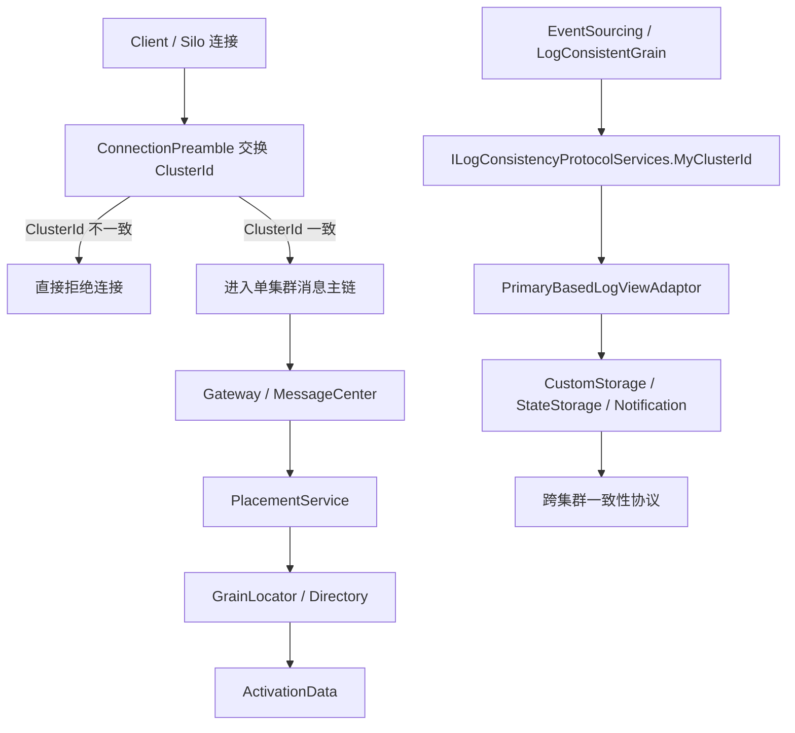

# 多集群与 Geo-Distribution：Orleans 里这套能力到底在哪儿、能做到什么、做不到什么（第二十六篇）

这一篇会帮你省掉很多"Orleans 多集群到底能做到什么程度"的猜测。结论可能会让一些人意外：Orleans 源码里没有一个统一的多集群子系统。这一篇把"有什么"和"没什么"都列清楚。

## 先说结论

Orleans 这份源码里，**没有一个像单集群主链那样完整、干净、统一的“多集群 / geo-distribution”子系统**。

更准确地说，源码里能看到三层东西：

- **集群边界**是硬的，网络握手会直接校验 `ClusterId`，不属于同一个 cluster 的连接会被拒掉。
- **单集群内分发**是成熟主线，包括 gateway、placement、grain directory、client directory，这些都默认服务于一个 cluster。
- **多集群相关能力**主要藏在 `Orleans.EventSourcing` 的一致性协议里，靠 `MyClusterId`、protocol services、primary cluster 这类配置去撑，不是通用 grain 路由。

所以，如果你问“Orleans 有没有全球统一路由、跨集群自动寻址、全局单实例 grain 这类主能力”，答案基本是：**没有成型的通用实现，至少在这份源码里没有作为主干出现**。能找到的是一些遗留名词、少量特例，以及事件溯源场景下的跨集群一致性协议。

## 一条主链

翻成人话，这条链说明了 Orleans 的真实态度：

1. 先把 cluster 边界卡死，别让不该进来的流量混进来。
2. cluster 内部的寻址、放置、目录、回调，照单集群主链跑。
3. 真要做跨集群，只在少数特定协议里做，而且是“协议级”，不是“通用路由级”。

## 1. 主线其实是“单集群”

源码里最明确的一层，是网络层对 `ClusterId` 的强校验。

- `src/Orleans.Core/Networking/ClientOutboundConnection.cs`
- `src/Orleans.Runtime/Networking/GatewayInboundConnection.cs`
- `src/Orleans.Runtime/Networking/SiloConnection.cs`

这几处代码的意思都很直白：连接建立后，双方要交换 preamble，里面带 `ClusterId`，然后现场比对。

只要不一致，就直接报错。也就是说，**Orleans 默认不是一个“多集群自动联邦”的系统，而是一个“先确认你是不是同一个 cluster，再谈消息”的系统**。

这也解释了为什么很多人想找“跨集群 gateway”时会觉得不顺：因为 gateway 这条路本来就不是跨 cluster 设计的。

## 2. 目录和路由，都是 cluster 内语义

Orleans 里和“路由”最接近的两个东西，还是单集群内部的目录系统：

- `ClientDirectory`
- `DistributedGrainDirectory`

### `ClientDirectory` 只是在 cluster 内把 client 路由传一圈

`src/Orleans.Runtime/GrainDirectory/ClientDirectory.cs` 里写得很清楚：

- 它维护的是“已知 client 的路由表”
- 它会监听本地连接和 membership 变化
- 它会把路由更新按 ring 的方式在 **同一个 cluster** 内传播

这不是多集群路由，更像是“集群内 client 地址同步”。

### `DistributedGrainDirectory` 也不是 geo-distribution

`src/Orleans.Runtime/GrainDirectory/DistributedGrainDirectory.cs` 是一个容易误会的地方。

它确实是“分布式目录”，但分布的是 **单个 cluster 内的 grain directory**，不是跨数据中心、跨 cluster 的全局目录。

它的核心是：

- 用 consistent hash ring 切分目录分片
- 根据 cluster membership 的 view 变化做 range ownership 转移
- 必要时做 snapshot transfer / recovery

源码注释里甚至把它直接类比成 Dynamo / Cassandra 的 vnode 思路。这个东西很强，但它解决的是 **同一 cluster 内目录扩展和容错**，不是“全球路由”。

而且它还是实验性的：

- `src/Orleans.Runtime/Hosting/CoreHostingExtensions.cs`
- `AddDistributedGrainDirectory(...)` 标了 `[Experimental("ORLEANSEXP003")]`

这说明 Orleans 自己也在告诉你：这块能用，但还没到“核心主干、无脑默认”的程度。

## 3. 真正带一点“多集群味道”的，是事件溯源

如果只看 `Orleans.EventSourcing`，你会看到 Orleans 确实给多集群留了口子。

关键文件：

- `src/Orleans.EventSourcing/LogConsistency/ILogConsistencyProtocolServices.cs`
- `src/Orleans.EventSourcing/LogConsistency/ProtocolServices.cs`
- `src/Orleans.EventSourcing/LogConsistency/IProtocolParticipant.cs`
- `src/Orleans.EventSourcing/LogConsistency/LogConsistentGrain.cs`
- `src/Orleans.EventSourcing/StateStorage/LogViewAdaptor.cs`
- `src/Orleans.EventSourcing/CustomStorage/LogConsistencyProvider.cs`
- `src/Orleans.EventSourcing/Hosting/CustomStorageSiloBuilderExtensions.cs`

这里的关键不是“跨集群 grain 调用”，而是“跨集群一致性协议”。

### 3.1 `MyClusterId` 是协议层信息，不是通用路由能力

`ILogConsistencyProtocolServices.MyClusterId` 的注释很直白：

- 如果没有 multi-cluster network，它就返回 `"I"`

这说明 Orleans 里确实有一层“我属于哪个 cluster”的协议上下文，但它是给 event sourcing 的 log-consistency adaptor 用的，不是给普通 grain 调用做全局路由的。

### 3.2 `LogViewAdaptor` 里才真的在处理“不同 cluster 的同一份状态”

`StateStorage/LogViewAdaptor.cs` 这类 adaptor 会把 `MyClusterId` 写进状态元数据，用来做：

- write bit 翻转
- optimistic concurrency
- 多 cluster 之间的状态同步判定

这类代码的心智模型更像“多个 cluster 共同维护一个有主写入点的状态”，而不是“请求随便路由到任意 cluster 的 grain”。

### 3.3 `PrimaryCluster` 是一个很强的信号

`src/Orleans.EventSourcing/CustomStorage/LogConsistencyProvider.cs`
和
`src/Orleans.EventSourcing/Hosting/CustomStorageSiloBuilderExtensions.cs`
里都能看到 `PrimaryCluster`。

它表达的是：

- 这类 provider 可以被配置成只允许某个主 cluster 写
- 其他 cluster 只能读，或者根本不允许提交更新

这已经很接近“跨集群共享状态”了，但本质还是 **协议级一致性**，不是 **通用 grain 迁移 / 路由**。

## 4. 全局单实例和跨集群 grain 路由，源码里其实很弱

你如果专门找 `GlobalSingleInstance`、`MultiClusterNetwork`、`GeoClient` 这几个词，会发现一个很有意思的事实：

- `ErrorCodes.cs` 里有 `MultiClusterNetworkBase`、`GlobalSingleInstanceBase`
- `UniqueKey.cs` 里留着一句 `// 7 was GeoClient`

但我没有在 `src` 里找到一个现在仍然在主链里跑的、完整的“全局单实例 grain 调度器”或者“跨 cluster grain router”。

这说明两件事：

1. 这些概念曾经存在过，或者至少被设计过。
2. 现在的代码库里，它们更多是历史痕迹，而不是现成主功能。

所以如果你要“完整复刻一版”，这块反而要特别小心：**不要把旧名词当成已经存在的实现**。源码给你的信号是“这里曾经有人想过”，不是“这里已经成了稳定主链”。

## 5. 为什么这块总是不如单集群主链顺

我觉得原因不是一个，而是几层叠在一起：

### 5.1 Orleans 的默认假设就是“一个 cluster 里把事情做完”

消息、gateway、目录、placement、activation，核心主链都围绕单 cluster 设计。

这套模型很完整，所以平时非常顺；但一旦你想跨 cluster，就会撞上边界：

- 连接层先拦 cluster id
- 目录和 placement 只认本 cluster 的 membership
- activation / catalog 只管理本 cluster 的生命周期

### 5.2 多集群能力被拆到了别的子系统里

真正有 cluster id 语义的代码，主要落在：

- networking
- event sourcing
- 版本/成员管理
- 一部分历史遗留类型

这就让“多集群”看起来像一堆分散的配件，而不是一个统一的 runtime 结构。

### 5.3 很多能力还是特例，不是通用抽象

比如：

- `DistributedGrainDirectory` 是实验性的
- `PrimaryCluster` 是某些 provider 的配置项
- `IProtocolParticipant` 只服务于 log-consistency 协议

这些都能工作，但都不是“任意 grain 都能天然跨集群”的统一抽象。

## 6. 这套能力现在在 Orleans 里的位置和成熟度

我会把它分成四档：

### 成熟主线

- 单集群网络
- gateway / messaging
- placement
- grain directory
- client directory

这部分是 Orleans 真正的主心骨。

### 可用但偏实验

- `AddDistributedGrainDirectory(...)`

它解决的是 cluster 内目录扩展，不是跨 cluster 联邦。

### 只在特定场景里成立

- `Orleans.EventSourcing` 里的 multi-cluster coherence
- `MyClusterId`
- `PrimaryCluster`

这是协议级能力，不是通用路由。

### 历史痕迹

- `GlobalSingleInstanceBase`
- `MultiClusterNetworkBase`
- `GeoClient`

它们提醒你：Orleans 曾经碰过这些方向，但现在源码里没有把它们收成一个清晰、统一、稳定的主干。

## 7. 推荐阅读顺序

如果你想顺着源码真正把这块吃透，我建议这样看：

1. `src/Orleans.Runtime/Networking/ClientOutboundConnection.cs`
2. `src/Orleans.Runtime/Networking/GatewayInboundConnection.cs`
3. `src/Orleans.Runtime/GrainDirectory/ClientDirectory.cs`
4. `src/Orleans.Runtime/GrainDirectory/DistributedGrainDirectory.cs`
5. `src/Orleans.Runtime/GrainDirectory/DirectoryMembershipSnapshot.cs`
6. `src/Orleans.EventSourcing/LogConsistency/ILogConsistencyProtocolServices.cs`
7. `src/Orleans.EventSourcing/LogConsistency/ProtocolServices.cs`
8. `src/Orleans.EventSourcing/StateStorage/LogViewAdaptor.cs`
9. `src/Orleans.EventSourcing/CustomStorage/LogConsistencyProvider.cs`
10. `src/Orleans.Core.Abstractions/IDs/Legacy/UniqueKey.cs`
11. `src/Orleans.Core.Abstractions/Logging/ErrorCodes.cs`

如果只想抓“为什么这块不像单集群主链那么顺”，先看前 5 个就够了。  
如果想抓“多集群到底落在哪些特例上”，再接着看 event sourcing 那 4 个。
