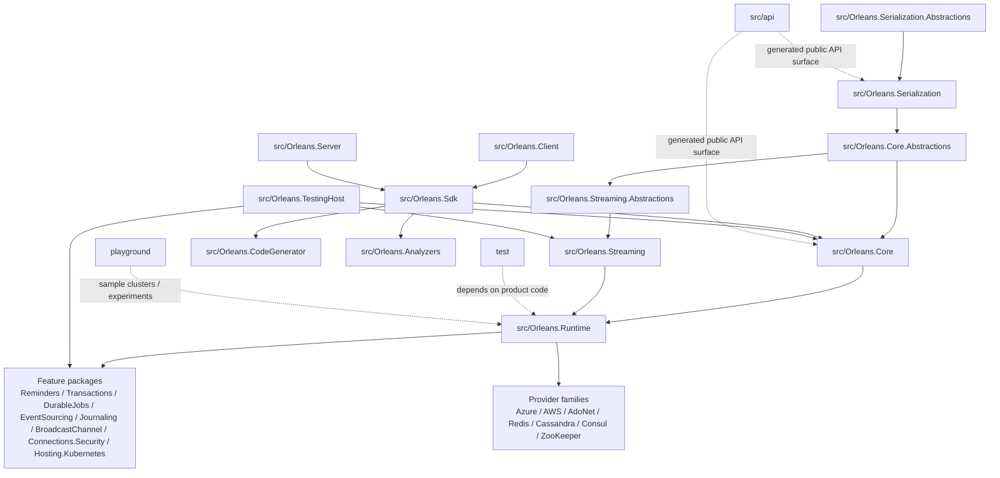

# 源码目录与项目依赖图总表（第二十九篇）

这篇是一张导航地图。如果你刚进 Orleans 源码，不知道从哪看起，先看这篇，弄清目录和依赖关系，再按需深入具体模块。

## 先说结论

如果把 Orleans 当成一棵树来看，它不是“一个 runtime 外挂几个插件”，而是“一个编程模型，下面长出编译期工具、共享基础、核心运行时、能力包、Provider 家族、测试基建和示例工地”。

真正最值得先抓住的主干只有一条：

- `Serialization.Abstractions` → `Serialization`
- `Core.Abstractions` → `Core`
- `Core` → `Runtime`
- `Runtime` 再向上挂出 `Streaming`、`Reminders`、`Transactions`、`DurableJobs`、`EventSourcing`、`Journaling`、`BroadcastChannel`、`Connections.Security`、`Hosting.Kubernetes` 这些能力包

如果你是打算“完整复刻一版”，正确的起点不是先看所有项目，而是先把这条主干和两类旁支看通：

- 编译期旁支：`Sdk`、`CodeGenerator`、`Analyzers`
- 生态旁支：`Azure`、`AWS`、`AdoNet`、`Redis`、`Cassandra`、`Consul`、`ZooKeeper`

再往后，`test` 是用来验证边界和使用姿势的，`playground` 是用来验证运行时行为和实验性想法的。

## 总图

这张图要读成三层意思：

1. 上半部分是 Orleans 的“真实骨架”，也就是抽象层、共享层、运行时层。
2. 中间是编译期工具和入口包装，它们不负责业务逻辑，但决定项目怎么被消费、怎么被生成、怎么被检查。
3. 下半部分是外部世界：Provider、测试、样例，它们把核心骨架接到真实存储、消息系统、集群环境和验证场景上。

## 主要目录怎么分

### `src/Orleans.Serialization.Abstractions`、`src/Orleans.Serialization`

这两层是序列化系统的起点。

- `Orleans.Serialization.Abstractions` 放的是序列化协议的公共抽象、特性和最小依赖。
- `Orleans.Serialization` 才是具体实现，包括 codec、copier、type manifest、reference 编解码、消息序列化等。
- `src/Orleans.Serialization.*` 这一组适配器是把 Orleans 的序列化系统接到 `System.Text.Json`、`Newtonsoft.Json`、`MessagePack`、`MemoryPack`、`FSharp` 等生态上。
- `src/Serializers/Orleans.Serialization.Protobuf` 也是这个家族的旁支，不是核心 runtime。

如果你想复刻 Orleans 的 wire format 兼容性，先从这里下手，比直接看 `Runtime` 更稳。

### `src/Orleans.Core.Abstractions`、`src/Orleans.Core`

这两层是 Orleans 编程模型的底座。

- `Orleans.Core.Abstractions` 负责对外 API 形状，比如 grain、ID、属性、请求上下文、版本和放置相关的抽象。
- `Orleans.Core` 负责共享运行时设施，比如默认服务、消息模型、客户端基础设施、配置和宿主接入。

很多人第一次看 Orleans 会把 `Runtime` 当成主角，但从仓库结构上说，`Core` 才是“用户先接触到的那一层”。

### `src/Orleans.Runtime`

这是运行时主战场。

- 激活
- 调度
- 目录
- 放置
- 消息收发
- 成员管理
- 生命周期
- 系统 target

前面几篇里讲到的很多核心链路，最终都会落到这里。

### `src/Orleans.Streaming.Abstractions`、`src/Orleans.Streaming`

这条线是流系统。

- `Streaming.Abstractions` 放最小抽象。
- `Streaming` 放完整实现，往下会接 queue adapter、pub/sub、pulling agent、流提供方等东西。

它的依赖位置很明确：抽象依赖 `Core.Abstractions`，实现依赖 `Runtime`，所以它本质上是挂在主运行时上的一条大能力线。

### `src/Orleans.Reminders`、`src/Orleans.DurableJobs`、`src/Orleans.Transactions` 等能力包

这一组包的共同点是：

- 它们都建立在 `Runtime` 之上。
- 它们不是新的基础设施，而是把 Orleans 的 runtime 能力再封装成一类更高层的语义。
- 它们常常和 storage/provider 绑定在一起，所以阅读时不能只看单个项目。

可以优先这样理解：

- `Reminders` 是时间语义的持久化扩展。
- `Transactions` 是分布式一致性语义的扩展。
- `DurableJobs` 是长期任务和运行时调度的扩展。
- `EventSourcing`、`Journaling` 是状态演进和日志化语义的扩展。
- `BroadcastChannel`、`Connections.Security`、`Hosting.Kubernetes` 是更偏系统能力和部署能力的扩展。

### `src/Orleans.Sdk`、`src/Orleans.CodeGenerator`、`src/Orleans.Analyzers`

这是编译期工具链。

- `Orleans.Sdk` 是给用户项目用的聚合入口，更像一个 Meta Package。
- `Orleans.CodeGenerator` 负责生成代理、invokable、serializer、activator 等代码。
- `Orleans.Analyzers` 负责静态检查和提示。

这三者不是业务实现本身，但它们决定 Orleans 为什么能做到“看起来像直接调用对象，实际上是透明远程调用”。

### `src/Orleans.Client`、`src/Orleans.Server`、`src/Orleans.TestingHost`

这几个名字很像 runtime 组件，但它们更像安装包和启动包装。

- `Orleans.Client` 主要是客户端消费入口。
- `Orleans.Server` 主要是服务器端消费入口。
- `Orleans.TestingHost` 是测试用的组合宿主，把 runtime、流、提醒、持久化、作业等常用能力打包起来。

这类项目很重要，但它们不是你最该先读的“算法核心”。

### `src/Azure`、`src/AWS`、`src/AdoNet`、`src/Redis`、`src/Cassandra`、`src/Orleans.Clustering.Consul`、`src/Orleans.Clustering.ZooKeeper`

这一组是 Provider 家族。

它们的共性是：

- 都挂在核心 runtime 或 streaming/reminders 之上。
- 都是把 Orleans 的抽象接到具体外部系统。
- 大多会共享一些 `Shared` 目录里的实现片段，所以你不能只按文件夹名找逻辑，得按项目边界和依赖去找。

从结构上看，这一层是 Orleans 最典型的“横向扩展面”。

### `src/Dashboard`

Dashboard 是一个独立味道很强的功能块。

- 它不是核心 runtime。
- 它依赖 `Runtime`、`Reminders` 等能力。
- 它同时带着 Web 应用和观测展示的特征。

如果你想理解 Orleans 的运维和可视化能力，可以单独把它当成一个小产品来看。

### `src/api`

这个目录不是业务源码，而是公开 API surface 的生成结果。

它的价值不是“参与运行”，而是“帮你看清楚哪些类型是公开契约，哪些是内部实现”。

对于复刻工作来说，这个目录非常适合拿来做两件事：

- 对照当前实现的 public surface。
- 检查你重构后的 API 有没有不小心改掉。

### `test`

测试目录不是附属品，而是读 Orleans 的第二张地图。

- 很多边界行为只在测试里说得清楚。
- 很多 provider 的组合方式也只有测试里最完整。
- `TestInfrastructure`、`TestExtensions`、`TesterInternal` 这一类工程，基本就是“仓库怎么把生产代码拼起来”的缩影。

如果你要确认某个 feature 是“真能力”还是“只有接口”，先看测试通常更快。

### `playground`

`playground` 是实验区。

- 有些用于验证调度、重平衡、shedding、混沌集群之类的场景。
- 它更接近工程验证，而不是正式产品代码。

如果你要找“这个机制到底会不会在真实负载下长什么样”，这里很有价值。

## 核心依赖关系

按“谁依赖谁”直说，Orleans 的主干关系大概是这样：

- `Orleans.Serialization.Abstractions` 是最底层的契约。
- `Orleans.Serialization` 依赖 `Serialization.Abstractions`，再往上给 `Core.Abstractions` 提供序列化能力。
- `Orleans.Core.Abstractions` 依赖序列化层，定义对外编程模型。
- `Orleans.Core` 依赖 `Core.Abstractions`，把客户端和共享运行时逻辑补齐。
- `Orleans.Runtime` 依赖 `Core`，负责真正跑起来。
- `Streaming` 依赖 `Runtime`，而 `Streaming.Abstractions` 只挂在 `Core.Abstractions` 上。
- `Reminders`、`Transactions`、`DurableJobs`、`EventSourcing`、`Journaling`、`BroadcastChannel` 这些功能包都在 `Runtime` 之上生长。
- `Sdk` 把 `CodeGenerator` 和 `Analyzers` 包进去，再把编译期能力送给用户项目。
- `Client`、`Server`、`TestingHost` 更像入口组合层，不是核心实现层。
- 各类 `Azure`、`AWS`、`AdoNet`、`Redis`、`Cassandra`、`Consul`、`ZooKeeper` Provider 都是在核心抽象和运行时之上接外部系统。

如果你只记一句话，那就是：

> Orleans 的主干不是“功能包堆起来的集合”，而是“抽象层先定形，运行时层再落地，最后让大量 provider 和 feature 包往上挂”。

## 这仓库组织上不够干净的地方

我觉得不够干净的地方主要有几处：

- `src` 下面同时放了核心层、功能层、Provider 家族、Dashboard、序列化适配器，目录名并不完全按职责收敛。
- `Client`、`Server`、`Sdk` 这些名字很像运行时项目，但实际很多是 Meta Package 或编译期入口，容易误导第一次看仓库的人。
- 关键构建逻辑不只在 `.csproj`，还散在 `Directory.Build.props`、`Directory.Build.targets`、`src/Directory.Build.props`、`test/Directory.Build.props` 里，不跳过去就看不懂全局行为。
- `src/api` 是生成出来的公开 API 镜像，不是正常手写源码树，这会让目录感看起来比实际复杂。
- Provider 家族大量使用 `Shared`、partial、条件编译和多项目复用，导致“按文件夹找逻辑”经常不如“按项目依赖找逻辑”有效。
- `src/Dashboard`、`src/Serializers` 这类目录命名和主干命名风格不完全统一，读起来会稍微拧一下。
- `test` 目录不是单纯验证层，它还承担了很多“示范如何组装整个系统”的作用，所以它和生产代码的边界没有一般项目那么清楚。

这些问题不影响 Orleans 能不能用，但确实会影响“把它完整复刻出来”时的心智负担。

## 推荐阅读顺序

如果你的目标是继续往深里读，我建议按这个顺序来：

1. 先看根部构建逻辑：`Directory.Build.props`、`Directory.Build.targets`、`src/Directory.Build.props`、`src/Directory.Build.targets`、`test/Directory.Build.props`。
2. 再看 `src/api`，先把公开 surface 的边界记住。
3. 看 `src/Orleans.Serialization.Abstractions` 和 `src/Orleans.Serialization`，把 wire format 和类型系统摸清。
4. 看 `src/Orleans.Core.Abstractions` 和 `src/Orleans.Core`，理解 Orleans 对外的编程模型和共享底座。
5. 看 `src/Orleans.Runtime`，把真正的运行时主链串起来。
6. 看 `src/Orleans.Streaming.Abstractions` 和 `src/Orleans.Streaming`，再把一条大能力线补上。
7. 看 `src/Orleans.Reminders`、`src/Orleans.Transactions`、`src/Orleans.DurableJobs`、`src/Orleans.EventSourcing`、`src/Orleans.Journaling`、`src/Orleans.BroadcastChannel`、`src/Orleans.Connections.Security`、`src/Orleans.Hosting.Kubernetes`，把 feature 包怎么挂上去看明白。
8. 看 `src/Azure`、`src/AWS`、`src/AdoNet`、`src/Redis`、`src/Cassandra`、`src/Orleans.Clustering.Consul`、`src/Orleans.Clustering.ZooKeeper`，理解 Provider 生态怎么接入。
9. 看 `src/Orleans.Sdk`、`src/Orleans.CodeGenerator`、`src/Orleans.Analyzers`，把编译期闭环补齐。
10. 看 `src/Orleans.Client`、`src/Orleans.Server`、`src/Orleans.TestingHost`，理解入口包装和默认组合。
11. 最后看 `test` 和 `playground`，用它们来校验前面理解的是不是对的。

如果你按这条顺序读，基本不会在一开始就被项目数量和目录名字绕晕。

