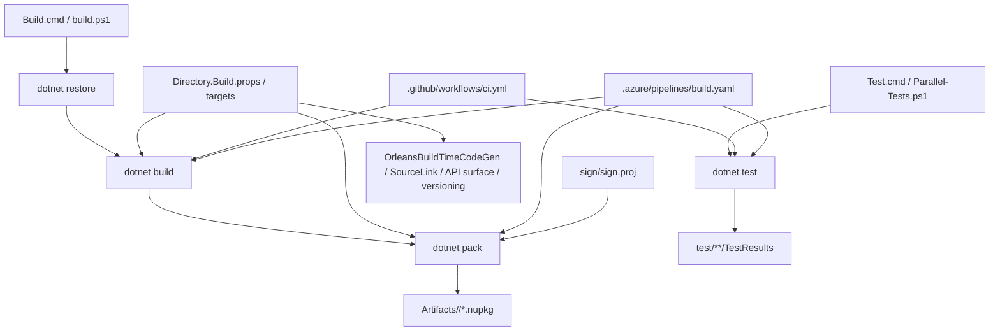

# 构建链与贡献工作流：Orleans 怎么 build/test/package，开发时该怎么跑（第三十篇）

## 先说结论

Orleans 的构建链不是“顺手跑个 `dotnet build`”这么简单，它其实把三件事绑死在一起了：

- 源码怎么被编译成可引用的组件
- 这些组件怎么被打成 NuGet 包和构建产物
- 你改完一个模块后，应该用什么粒度去验证它

所以这仓库要想看懂，不能只看 `src`，还得把根目录的构建脚本、`Directory.Build.*`、`test` 目录和 CI 配置一起看。否则你会经常遇到一种错觉：明明只是改了一个项目，结果生成器、API surface、包输出、测试筛选、签名和版本号全都跟着动。

一句话概括：

> Orleans 的源码阅读和构建阅读是同一件事。它不是先看代码、再看构建，而是必须把构建链当成源码的一部分来读。

---

## 1. 主链先串起来

这张图要读成四层：

- 根目录脚本负责“怎么起手”
- `Directory.Build.*` 负责“全仓库统一规则”
- CI 负责“按不同平台和场景验证”
- `sign/` 和 `src/api/` 负责“把产物变成能发布、能审计、能对外看的形态”

---

## 2. 根目录的真实入口

### `Build.cmd` 和 `build.ps1`

根入口很直接：

- `Build.cmd` 只是把命令转给 `build.ps1`
- `build.ps1` 才是真正的构建编排

它做的事情大致是：

- 读取 `Orleans.slnx`
- 默认用 `Debug`
- 清掉 `Platform`
- 关闭 `DOTNET_MULTILEVEL_LOOKUP`
- Debug 模式下额外塞一个时间戳后缀
- 先 `restore`
- 再 `build`
- 最后 `pack`

这里有个很重要的点：

- `pack` 默认是跟在 `build` 后面跑的
- 产物默认落在 `Artifacts/<Configuration>`

也就是说，这仓库的“本地发布感”不是编译后看 `bin/`，而是看 `Artifacts/`。

### `Test.cmd`、`TestAll.cmd`、`Parallel-Tests.ps1`

测试入口也不是单一脚本。

- `Test.cmd` 负责挑出一组常用测试项目
- `TestAll.cmd` 只是把筛选条件扩成更全的类别
- `Parallel-Tests.ps1` 才是真正把多个测试项目并行跑起来的地方

`Parallel-Tests.ps1` 的策略很明确：

- 默认只跑 `BVT` 和 `SlowBVT`
- 如果环境变量里有 `TEST_FILTERS`，就用它
- 每个测试项目单独起 `dotnet test`
- 并行度最多到 4
- 明确关掉并行测试和 shadow copy

这说明 Orleans 对测试的态度不是“所有测试一锅端”，而是按场景、按类别、按项目切。

---

## 3. `Directory.Build.*` 才是全局骨架

### 根目录 `Directory.Build.props`

这个文件决定了仓库很多默认行为：

- 定义 `SourceRoot`
- 统一包元信息、版本号、许可证、仓库地址
- `ContinuousIntegrationBuild` 在 CI 环境自动打开
- 默认把包输出到 `Artifacts/$(Configuration)`
- 处理 `GitHeadSha`
- Debug 下自动加 `VersionSuffix`

它还有一个很关键的开关：

- `OrleansBuildTimeCodeGen=true` 时，会把代码生成器相关 props 拉进来

换句话说，很多项目表面上只是普通 `csproj`，实际上编译时已经被仓库级规则改造过了。

### 根目录 `Directory.Build.targets`

这个文件更像“编译时的补丁层”：

- 把 `InformationalVersion` 拼成 `版本号 + commit hash`
- 在 `OrleansBuildTimeCodeGen=true` 时，把 `Orleans.CodeGenerator` 和 `Orleans.Analyzers` 作为 analyzer 引进来
- 条件满足时，还会把 `Orleans.Core.targets` 接进去

这件事的含义很直接：

- 你看到的源码，不等于编译时真正参与构建的全部内容
- 有些行为是靠 `targets` 注入进去的，不在项目文件里明写

### `src/Directory.Build.props`

`src` 下的规则更偏产品层：

- 默认支持 `netstandard2.0`
- 默认目标框架是 `net8.0;net10.0`
- 默认 `IsPackable=true`
- 自动生成 README、SourceLink、API surface
- 给源码打上 `FrameworkPartAttribute`

这里最值得注意的是：

- `src/api` 不是手写源码，而是公开 API surface 的生成结果
- `Microsoft.DotNet.GenAPI.Task` 让仓库能持续输出“对外契约长什么样”

### `test/Directory.Build.props`

测试目录则故意反过来：

- `IsPackable=false`
- 不生成包
- 不生成文档
- 默认测试框架也是 `net8.0;net10.0`
- 额外挂上 `coverlet.collector`

这意味着测试工程的目标很清楚：

- 它不是产物
- 它是验证层

---

## 4. 源码怎么变成 NuGet 和 Artifacts

Orleans 的包化链路大概是这样：

- 每个可打包项目在 `src` 下按统一规则构建
- `dotnet build` 先把编译产物和生成物跑出来
- `dotnet pack --no-build --no-restore` 再把它们打成包
- 包默认落到 `Artifacts/<Configuration>`
- 一些包还会经过 `sign/sign.proj` 做签名

这里有几个细节很重要：

- 产物路径不是传统的项目内 `bin/Release`
- 本地和 CI 都尽量沿着同一套输出规则走
- `sign/` 下面的工程把包签名单独抽出来了
- `src/api` 会持续反映 public API 的变化

所以从“源码到 NuGet”的链路，不只是编译和压缩包，而是：

1. 编译
2. 生成器和 analyzers 注入
3. API surface 更新
4. 打包
5. 签名
6. 发布到本地 `Artifacts` 或外部 feed

这也是为什么 Orleans 的构建链值得单独研究。它直接决定了外部用户拿到的到底是什么。

---

## 5. 改一个模块后，通常该跑什么

这个仓库的推荐做法不是“每次都全量重建一遍”，而是按改动范围分层跑。

### 只改一个普通 runtime 模块

通常先跑：

- `dotnet build`
- 相关单元测试项目
- 和这个模块最贴近的集成测试项目

如果你改的是 `src/Orleans.Runtime`、`src/Orleans.Core` 这类主干模块，最好再补一轮：

- `Test.cmd`
- 或者按类别过滤的 `dotnet test`

### 改了生成器、analyzer 或 `OrleansBuildTimeCodeGen` 相关内容

除了正常 build/test，还应该额外关注：

- 代码是否还会被正确生成
- `src/api` 是否出现 API surface 变化
- 相关项目的编译时注入是否还成立

这类改动不能只看“能不能编过”，要看“生成出来的东西是不是还是 Orleans 想要的样子”。

### 改了 provider、存储、流、事务这类能力包

一般要补：

- 对应 provider 的测试项目
- 相关场景的 functional/BVT 测试
- 如果改动牵涉外部系统，再看 CI 里对应的分类测试怎么跑

### 改了测试基建

比如 `TestCluster`、`TestHooks`、`InMemory` provider、测试宿主这类东西，最好直接跑：

- `test/TestInfrastructure`
- `src/Orleans.TestingHost` 相关测试
- 和它绑定的上层功能测试

因为这类改动最容易出现“本地看起来没事，但别的测试全部一起炸”的情况。

---

## 6. CI 和本地构建差在哪

### 本地构建

本地构建的目标是：

- 快速验证改动
- 给你一个可引用的本地包
- 尽量沿用仓库统一规则，但允许开发者模式

它通常更宽松：

- 默认是 developer build
- Git commit 不一定会烧进产物
- 很多时候只需要 `dotnet build` 或 `Build.cmd`

### GitHub Actions

`.github/workflows/ci.yml` 更像“广覆盖验证”：

- 多平台矩阵
- 多种 provider 场景
- 通过 category 过滤测试
- 上传 binlog 和测试结果

它关心的是“PR 会不会在不同环境下炸”。

### Azure Pipelines

`.azure/pipelines/build.yaml` 和模板链更偏正式发布侧：

- 支持 Release/Debug 配置
- 可以走签名
- 可以发 nightly 或正式 NuGet
- 会按框架和测试类别跑矩阵
- 还会挂 CodeQL、发布步骤和审批流

所以本地和 CI 的差异，不只是“机器不同”，而是“目标不同”：

- 本地更偏开发验证
- GitHub Actions 更偏 PR 回归
- Azure Pipelines 更偏发布和签名

---

## 7. 为什么这条构建链会影响你理解源码

这点很重要。

Orleans 的很多设计，不是单纯为了运行时逻辑，而是为了让构建链成立。

### 先说几个直接例子

- `OrleansBuildTimeCodeGen` 决定编译时会不会注入生成器和 analyzer
- `src/api` 让你看见 public surface 是怎么被固定下来的
- `SourceLink` 让包能追到源代码
- `InformationalVersion` 把版本和 commit 绑在一起
- `Artifacts/` 说明仓库在本地就按“可发布包”思路组织输出

### 再说一个更本质的点

Orleans 不是把所有能力都塞进运行时核心，而是把很多责任拆到：

- 项目级 `props`/`targets`
- 生成器
- analyzer
- packaging
- signing
- test harness

这会反过来影响你读源码的方式：

- 你不能只看 `.cs`
- 还得看这些 `.props`、`.targets`、workflow、脚本
- 很多“看不见的行为”其实都在构建层完成了

所以如果你想完整复刻一版 Orleans，构建链不是附属材料，而是核心设计的一部分。

---

## 8. 组织上不够干净的地方

我觉得这里有几处最明显的不够干净：

- 构建职责分散在根目录脚本、`Directory.Build.*`、`.azure/pipelines`、`.github/workflows`、`sign/` 和 `src/api`，没有一个统一的 `eng/` 入口把这些东西收拢起来。
- `Build.cmd`、`build.ps1`、`Test.cmd`、`Parallel-Tests.ps1` 这些脚本是 Windows 时代的遗留风格，能用，但阅读成本不低。
- 本地构建、CI 构建、发布构建的规则分层很多，第一次看很容易把“开发用规则”和“正式发布规则”混在一起。
- API surface 生成和源码本体分离在 `src/api`，它很有用，但也会让目录树看起来更像“代码 + 生成物”混杂在一起。
- `OrleansBuildTimeCodeGen` 这种开关很关键，但它是隐式地改变项目行为，不看 `Directory.Build.targets` 很难意识到。

这些都不是功能错误，但确实会让仓库显得不够直。

---

## 9. 推荐阅读顺序

如果你准备顺着这条线继续啃，我建议按这个顺序看：

1. 先看 `README.md` 里的 build/test 说明，先知道仓库希望你怎么用。
2. 再看 `CONTRIBUTING.md`，重点看项目引用规则和输出目录规则。
3. 接着看根目录 `Directory.Build.props` 和 `Directory.Build.targets`，把全局构建规则吃透。
4. 再看 `src/Directory.Build.props` 和 `test/Directory.Build.props`，理解产品代码和测试代码的不同约束。
5. 然后看 `build.ps1`、`Test.cmd`、`Parallel-Tests.ps1`，把本地入口串起来。
6. 再去看 `.github/workflows/ci.yml` 和 `.azure/pipelines/build.yaml`，比较本地和 CI 的差异。
7. 最后看 `sign/sign.proj` 和 `src/api`，把“源码怎么变成可发布物”补齐。

如果只想抓一条最短路径，那就直接读：

- `Directory.Build.props`
- `Directory.Build.targets`
- `build.ps1`
- `Parallel-Tests.ps1`
- `.azure/pipelines/build.yaml`
- `.github/workflows/ci.yml`

这几份文件看完，Orleans 的构建逻辑基本就有轮廓了。
