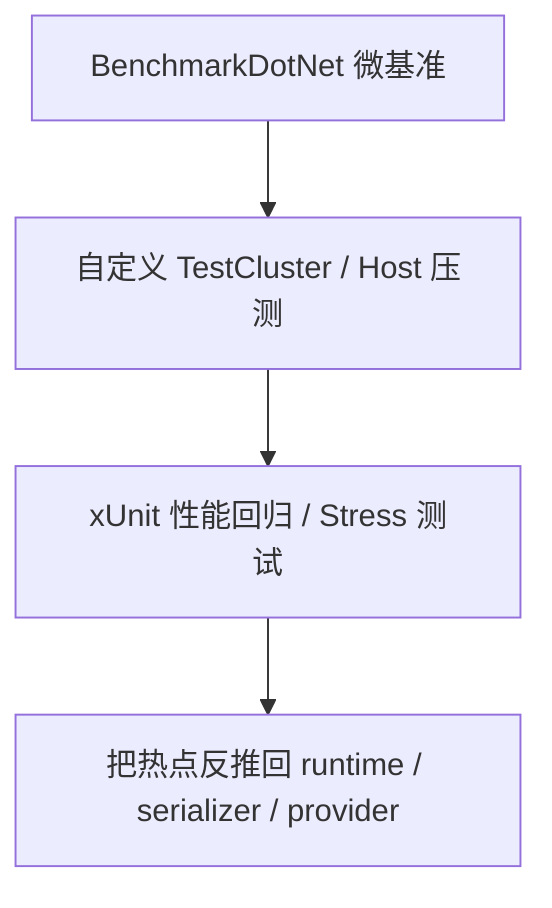

# Benchmark 与性能测试体系：Orleans 真正在意哪些热点（第三十一篇）

先说结论。

Orleans 这套性能体系，不是拿一堆“跑分”凑热闹。它其实很明确地围着几条主链打：

- 序列化和 wire protocol，尤其是字段头、引用、深拷贝和大对象图。
- grain 调用路径，尤其是 ping、并发调用、跨 silo 调用和 hosted client。
- 持久化状态读写，尤其是 storage provider、事务、限流和回写开销。
- streaming / queue adapter，尤其是 SQL 队列、批量、并发和表膨胀。
- 运行时内部数据结构，尤其是 dashboard 的 trace history、TopK / frequent item 之类的统计结构。

从这些测试里反推出的东西也很直接：

> Orleans 真正在乎的，不是某一个函数快不快，而是“整条链在高并发、跨进程、带持久化的时候会不会开始抖”。

所以这部分文档不只是在列 benchmark 项目，而是在把 Orleans 的性能关注点翻出来。

---

## 1. 主链怎么分层

这三层的分工很清楚：

- `BenchmarkDotNet` 负责单点、可重复、可对比的微基准。
- `TestCluster` 和自定义 runner 负责把 Orleans 真正跑起来，压整条链。
- xUnit 的 `Performance` / `Stress` 测试负责卡阈值，防止回归悄悄溜过去。

它们不是同一种东西，不能混着看。

---

## 2. BenchmarkDotNet 这层在测什么

关键工程主要有两个：

- [test/Benchmarks/Benchmarks.csproj](/Users/zhaoyiqi/Code/orleans/test/Benchmarks/Benchmarks.csproj)
- [test/Benchmarks.AdoNet/Benchmarks.AdoNet.csproj](/Users/zhaoyiqi/Code/orleans/test/Benchmarks.AdoNet/Benchmarks.AdoNet.csproj)

### 2.1 基准入口是怎么组织的

`test/Benchmarks/Program.cs` 不是纯 `BenchmarkSwitcher`，而是两种风格混在一起：

- 一类直接交给 `BenchmarkRunner` / `BenchmarkSwitcher`。
- 一类自己起 `TestCluster`，手工跑一段 load，再打印结果。

这说明 Orleans 对性能的态度很实用：能让 BDN 量化的就量化，量化不了的就自己跑集群。

`test/Benchmarks/Serialization/Utilities/BenchmarkConfig.cs` 也很有代表性：

- 开 `MemoryDiagnoser`
- 输出 GitHub 风格 Markdown
- 保留 benchmark 文件
- 同时跑 `Core80`、`Core90`、`Core10_0`

它关注的不是“单一运行时下某个数值”，而是跨运行时、跨版本的变化。

### 2.2 序列化是最重的微基准层

这一层里最像 Orleans 自己“命根子”的，是序列化相关基准：

- [test/Benchmarks/Serialization/FieldHeaderBenchmarks.cs](/Users/zhaoyiqi/Code/orleans/test/Benchmarks/Serialization/FieldHeaderBenchmarks.cs)
- [test/Benchmarks/Serialization/Comparison/ClassSerializeBenchmark.cs](/Users/zhaoyiqi/Code/orleans/test/Benchmarks/Serialization/Comparison/ClassSerializeBenchmark.cs)
- [test/Benchmarks/Serialization/MegaGraphBenchmark.cs](/Users/zhaoyiqi/Code/orleans/test/Benchmarks/Serialization/MegaGraphBenchmark.cs)
- [test/Benchmarks/Serialization/Comparison/CopierBenchmark.cs](/Users/zhaoyiqi/Code/orleans/test/Benchmarks/Serialization/Comparison/CopierBenchmark.cs)

它们分别在压：

- 字段头编码，尤其是 embedded / extended 两种路径。
- Orleans serializer 和外部 serializer 的吞吐对比。
- 超大对象图的序列化和反序列化。
- 深拷贝在数组、结构体、类上的代价。

这几项一起看，说明 Orleans 很在意：

- wire format 的边角成本。
- 大对象图的分配和遍历成本。
- 复制语义是不是太贵。

### 2.3 调用和消息路径的微基准

这条线最典型的是：

- [test/Benchmarks/Ping/PingBenchmark.cs](/Users/zhaoyiqi/Code/orleans/test/Benchmarks/Ping/PingBenchmark.cs)
- [test/Benchmarks/Ping/ConcurrentLoadGenerator.cs](/Users/zhaoyiqi/Code/orleans/test/Benchmarks/Ping/ConcurrentLoadGenerator.cs)
- [test/Benchmarks/MapReduce/MapReduceBenchmark.cs](/Users/zhaoyiqi/Code/orleans/test/Benchmarks/MapReduce/MapReduceBenchmark.cs)

`PingBenchmark` 不只是测一次 `grain.Run()`，它还分了几种路径：

- client 到单 silo
- client 到多 silo
- hosted client
- silo 到 silo
- 永久在线程负载

`ConcurrentLoadGenerator` 也不是简单 while loop，它自己把请求拆成 work block，再统计成功、失败和吞吐。

这说明 Orleans 真正在意的是：

- 调用代理打包之后的真实路径。
- 跨 silo、hosted client、client 三种入口的差别。
- 并发上去以后，消息调度还能不能稳住。

### 2.4 存储、事务、dashboard 也都在跑分

这几类也很关键：

- [test/Benchmarks/GrainStorage/GrainStorageBenchmark.cs](/Users/zhaoyiqi/Code/orleans/test/Benchmarks/GrainStorage/GrainStorageBenchmark.cs)
- [test/Benchmarks/Transactions/TransactionBenchmark.cs](/Users/zhaoyiqi/Code/orleans/test/Benchmarks/Transactions/TransactionBenchmark.cs)
- [test/Benchmarks/Dashboard/DashboardGrainBenchmark.cs](/Users/zhaoyiqi/Code/orleans/test/Benchmarks/Dashboard/DashboardGrainBenchmark.cs)
- [test/Benchmarks/TopK/TopKBenchmark.cs](/Users/zhaoyiqi/Code/orleans/test/Benchmarks/TopK/TopKBenchmark.cs)
- [test/Benchmarks.AdoNet/Streaming/MessageQueueingBenchmark.cs](/Users/zhaoyiqi/Code/orleans/test/Benchmarks.AdoNet/Streaming/MessageQueueingBenchmark.cs)
- [test/Benchmarks.AdoNet/Streaming/MessageDequeueingBenchmark.cs](/Users/zhaoyiqi/Code/orleans/test/Benchmarks.AdoNet/Streaming/MessageDequeueingBenchmark.cs)

这些基准测的不是“功能有没有”，而是：

- storage provider 的读写吞吐和尾延迟。
- 事务提交在 memory / Azure 下的差异，外加 throttling。
- dashboard 的 trace 历史写入、查询、聚合。
- TopK / frequent item collection 这种内部统计结构的维护成本。
- SQL 队列在并发、payload、batch size、表膨胀下的变化。

`test/Benchmarks/run_test.cmd` 也很直白，只给了一个本地复现命令：

- 先看 `git log`
- 再看 `git diff`
- 然后直接跑一个 streaming write benchmark

这说明 benchmark 既是测性能，也是本地定位回归的工具。

---

## 3. 压力测试和负载测试在压什么

这一层和 BDN 的区别是：它更像真实运行。

### 3.1 事务和持久化压力

`TransactionBenchmark` 会直接起 `TestCluster(4)`，然后切不同 storage 和 throttling 组合：

- memory storage
- Azure storage
- throttled / unthrottled

它最后关心的是：

- TPS
- failed transactions
- throttled transactions

`GrainStorageBenchmark` 也是同一类思路，只是目标换成持久化读写：

- `Init(payloadSize)`
- `TrySet(iteration)`
- 持续跑到 duration 结束
- 最后统计成功数、失败数、平均耗时、最长耗时

这类测试很像 Orleans 自己在问：

“这个 provider 真跑起来以后，会不会把整个调用链拖慢？”

### 3.2 语义边界上的压力

`ReentrancyTests` 里的 `Stress` 场景也很关键。它不是为了炫技，而是在测：

- reentrant 和 non-reentrant 的差别
- `MayInterleave` 的行为
- fan-out 和死锁边界

这类测试反映的是调度系统的热点，不是业务逻辑。

### 3.3 真正拿性能当门槛的回归测试

最像“性能回归门禁”的，是：

- [test/Orleans.Runtime.Internal.Tests/TestRunners/GrainPersistenceTestRunner.cs](/Users/zhaoyiqi/Code/orleans/test/Orleans.Runtime.Internal.Tests/TestRunners/GrainPersistenceTestRunner.cs)
- [test/Orleans.EventSourcing.Tests/EventSourcingTests/CountersGrainPerfTests.cs](/Users/zhaoyiqi/Code/orleans/test/Orleans.EventSourcing.Tests/EventSourcingTests/CountersGrainPerfTests.cs)
- [test/Extensions/Orleans.Azure.Tests/AzureTableDataManagerStressTests.cs](/Users/zhaoyiqi/Code/orleans/test/Extensions/Orleans.Azure.Tests/AzureTableDataManagerStressTests.cs)
- [test/Extensions/Orleans.AWS.Tests/StorageTests/DynamoDBStorageStressTests.cs](/Users/zhaoyiqi/Code/orleans/test/Extensions/Orleans.AWS.Tests/StorageTests/DynamoDBStorageStressTests.cs)

`GrainPersistenceTestRunner` 这类代码很说明问题：

- 先用 `TestUtils.CalibrateTimings()` 校准时间。
- 再用 `TestUtils.TimeRunAsync()` 对比 baseline。
- 超出目标就 `SkipException`，再严重就 `Assert.Fail`。
- 还会把 `Performance`, `CorePerf`, `Stress` 一起打标签。

它不是“测一下看看”，而是“超过阈值就不让过”。

---

## 4. 从这些测试反推 Orleans 的热点

我从仓库里这些测试读到的热点，大概就这几类：

1. 序列化和 wire protocol。字段头、session、深拷贝、超大对象图，都在被反复盯着。
2. 调用链本身。`Ping`、并发调用、client / hosted client / silo-to-silo 的差异，是最典型的主路径。
3. 持久化。storage provider 的 read/write、ETag、批量、回写、故障和恢复，都很重。
4. 事务。提交、限流、失败处理，尤其是高并发下的退化。
5. 流和队列。AdoNet streaming benchmarks 直接说明 queue adapter 是被认真对待的。
6. 内部统计结构。Dashboard、TopK 这类测试说明 Orleans 也在意运行时内部数据结构别太贵。
7. 调度和重入。很多 stress case 本质上是在问：并发上来以后，调度还能不能守住语义和吞吐。

这里有一个很实在的判断：

> Orleans 不是把性能热点平均分布在整个仓库里，而是集中压少数几个“链路放大器”。

---

## 5. 复刻建议

如果你要完整复刻一版 Orleans，我建议先把性能体系按下面顺序重建：

- 先做序列化微基准，特别是字段头、引用、对象图、deep copy。
- 再做最小 grain 调用链和 ping 压测，把 client / hosted client / silo-to-silo 路径分开。
- 接着做 storage provider 的读写压测，至少把 memory、table、blob、AdoNet 跑通。
- 然后补事务和 throttling，不然系统一到并发就会露馅。
- 再补 streaming / queue adapter，不然你看不清 Orleans 在高吞吐下的真实样子。
- 最后把 xUnit 的性能回归门禁补上，用阈值卡住退化。

我会把这套体系理解成两件事：

- 微基准负责定位“哪块慢”。
- 回归和压力测试负责回答“慢到什么程度算不能接受”。

---

## 6. 阅读顺序

如果要顺着源码继续看，我建议按这个顺序走：

- [test/Benchmarks/Program.cs](/Users/zhaoyiqi/Code/orleans/test/Benchmarks/Program.cs)
- [test/Benchmarks/Serialization/Utilities/BenchmarkConfig.cs](/Users/zhaoyiqi/Code/orleans/test/Benchmarks/Serialization/Utilities/BenchmarkConfig.cs)
- [test/Benchmarks/Serialization/FieldHeaderBenchmarks.cs](/Users/zhaoyiqi/Code/orleans/test/Benchmarks/Serialization/FieldHeaderBenchmarks.cs)
- [test/Benchmarks/Serialization/Comparison/ClassSerializeBenchmark.cs](/Users/zhaoyiqi/Code/orleans/test/Benchmarks/Serialization/Comparison/ClassSerializeBenchmark.cs)
- [test/Benchmarks/Ping/PingBenchmark.cs](/Users/zhaoyiqi/Code/orleans/test/Benchmarks/Ping/PingBenchmark.cs)
- [test/Benchmarks/GrainStorage/GrainStorageBenchmark.cs](/Users/zhaoyiqi/Code/orleans/test/Benchmarks/GrainStorage/GrainStorageBenchmark.cs)
- [test/Benchmarks/Transactions/TransactionBenchmark.cs](/Users/zhaoyiqi/Code/orleans/test/Benchmarks/Transactions/TransactionBenchmark.cs)
- [test/Orleans.Runtime.Internal.Tests/TestRunners/GrainPersistenceTestRunner.cs](/Users/zhaoyiqi/Code/orleans/test/Orleans.Runtime.Internal.Tests/TestRunners/GrainPersistenceTestRunner.cs)
- [test/Orleans.EventSourcing.Tests/EventSourcingTests/CountersGrainPerfTests.cs](/Users/zhaoyiqi/Code/orleans/test/Orleans.EventSourcing.Tests/EventSourcingTests/CountersGrainPerfTests.cs)

如果只想先抓一条主线，就先看序列化，再看 ping，再看 storage。这个顺序最不容易乱。
