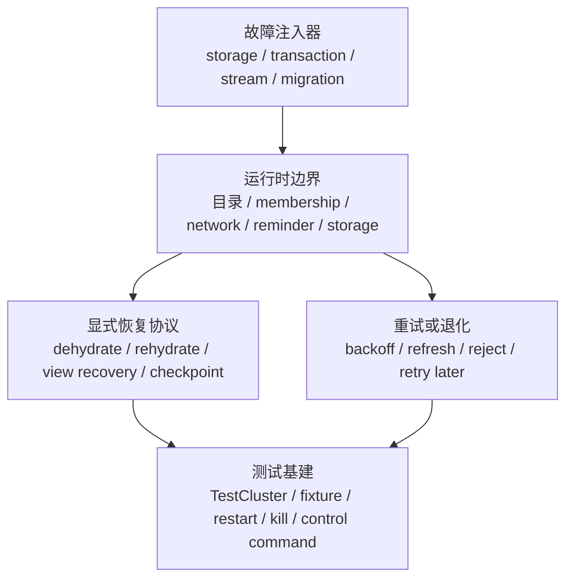

# 故障注入与恢复路径专题（第三十二篇）

先说结论。

Orleans 不是靠“一套大而全的故障注入框架”撑住所有失败场景，而是把这件事拆成了四层：

- 可插拔的故障注入器，专门往 storage、transaction、stream 这些边界里塞异常
- 显式恢复协议，靠版本、上下文和状态传递把系统拉回一致
- 重试和退化逻辑，先顶住失败，再慢慢恢复，实在不行就拒绝或降级
- 测试基建，把 kill/restart、RequestContext 标记、provider 注入、控制台命令这些手段拼起来验证

真正值得记住的一点是：Orleans 只有少数地方真的在“恢复”，大多数地方其实只是“重试”或“明确失败”。这两者差别很大。前者是协议，后者是策略。

## 1. 故障是怎么被打进去的

### 1.1 存储故障注入

`src/Orleans.TestingHost/TestStorageProviders/FaultInjectionStorageProvider.cs` 是最直接的存储故障装饰器。

它的做法很朴素：

- 先通过 `IStorageFaultGrain` 选择“这次要不要坏”
- 再给 `ReadStateAsync`、`WriteStateAsync`、`ClearStateAsync` 加一点延迟
- 如果 fault grain 触发异常，就直接抛出去
- 如果没触发，就调用真实的 `IGrainStorage`

也就是说，它不是 mock，而是“真实 provider 外面再套一层故障壳”。

测试里常见的入口是 `AddFaultInjectionMemoryStorage(...)`，例如 `test/Orleans.Streaming.Tests/StreamingTests/PubSubRendezvousGrainTests.cs` 就拿它来逼 pub/sub 的写入和清理路径报错，再看后续能不能恢复。

### 1.2 事务故障注入

事务这条线做得最完整。

关键文件在 `src/Orleans.Transactions.TestKit.Base/FaultInjection/ControlledInjection/` 和 `src/Orleans.Transactions.TestKit.Base/FaultInjection/RandomInjection/`：

- `FaultInjectionControl` 负责指定注入阶段和注入类型
- `FaultInjectionTransactionalState<TState>` 在 grain 生命周期里替换掉原本的事务状态资源
- `FaultInjectionTransactionManager<TState>` 和 `FaultInjectionTransactionalResource<TState>` 把注入点包在 2PC 的关键步骤外面
- `SimpleAzureStorageExceptionInjector` 用于控制注入时机
- `RandomErrorInjector` 用概率随机制造冲突、存储异常和一致性问题

这里的关键不是“抛一个异常”，而是把异常绑到事务协议的具体阶段上，比如：

- `BeforePrepare`
- `BeforeConfirm`
- `AfterPrepareAndCommit`
- `AfterAbort`
- `AfterPrepared`

这就能把事务从“碰巧失败”变成“在协议边界上失败”，测试价值高很多。

### 1.3 迁移故障注入

迁移这条线最有代表性。

`test/Orleans.DefaultCluster.Tests/Migration/MigrationTests.cs` 里直接通过 `RequestContext` 塞标记：

- `fail_dehydrate`
- `fail_rehydrate`

然后让 grain 在 `OnDehydrate(IDehydrationContext)` 或 `OnRehydrate(IRehydrationContext)` 时主动抛异常。

这不是模拟网络断了，而是在验证：

- 迁移协议本身有没有把“中途失败”当回事
- 失败以后 activation 会不会留下脏状态
- 失败后的下一次调用能不能重新回到可用状态

### 1.4 Streaming 故障注入

流系统的故障注入比较分散，但思路一致：

- `test/Orleans.Streaming.Tests/StreamingTests/PubSubRendezvousGrainTests.cs` 用故障 storage 压 pub/sub 状态
- `test/Orleans.Streaming.Tests/StreamingTests/GeneratedStreamRecoveryTests.cs` 验证 generated stream 在 transient / non-transient 错误下还能继续跑
- `test/Extensions/Orleans.Streaming.EventHubs.Tests/Streaming/EHImplicitSubscriptionStreamRecoveryTests.cs` 和 `EHStreamProviderCheckpointTests.cs` 验证 checkpoint、agent restart、silo restart 之后还能恢复消费
- `src/Azure/Orleans.Streaming.AzureStorage/Providers/Streams/PersistentStreams/AzureTableStorageStreamFailureHandler.cs` 则把“重试完了之后的失败”写入 table，必要时把订阅标成 faulted

这里要注意，流系统里很多“恢复”其实是 provider 级别的 checkpoint 恢复，不是 Orleans runtime 自己帮你补回事件。

## 2. 真正的恢复链路在哪

### 2.1 迁移是最标准的显式恢复协议

这条链路最干净。

核心文件是：

- `src/Orleans.Runtime/Catalog/ActivationData.cs`
- `src/Orleans.Runtime/Storage/StateStorageBridge.cs`
- `src/Orleans.Core.Abstractions/Core/Grain.cs`
- `src/Orleans.Core.Abstractions/Lifecycle/IGrainLifecycle.cs`

它的逻辑很明确：

1. activation 进入迁移流程
2. runtime 调 `OnDehydrate`
3. grain 自己和参与者把状态写进 `IDehydrationContext`
4. 状态传到目标 silo
5. 目标侧调用 `OnRehydrate`
6. grain 和参与者从 `IRehydrationContext` 里把状态取回来

这里的特点是：

- 有明确上下文对象
- 有明确的参与者顺序
- 有明确的版本/状态传递边界
- 失败会直接暴露出来，不是假装自己恢复了

`StateStorageBridge<TState>` 很关键，它把持久化状态也挂进了迁移协议里。对 `Grain<TState>` 来说，迁移不是简单的“把对象搬过去”，而是“把状态和生命周期参与者一起带过去”。

### 2.2 分布式 grain directory 的恢复是协议级的

`src/Orleans.Runtime/GrainDirectory/DistributedGrainDirectory.cs` 和 `GrainDirectoryPartition.cs` 是另一条很标准的恢复协议。

这条线解决的是：

- silo crash 之后，目录条目怎么找回来
- membership view 跳变之后，partition owner 不一致怎么办
- 新旧 owner 之间怎么做 range handoff

它不是靠“多试几次”混过去，而是明确分成两种动作：

- 正常 view change 时做分区交接
- view 跳跃或 owner 不确定时走 recovery

源码里还专门用了 `_recoveryMembershipVersion` 去挡竞态，避免“注册刚做了一半，恢复又开始收集活跃 activation”导致重复或丢失。

这就是 Orleans 里很典型的显式恢复协议：有版本、有 owner、有范围、有恢复窗口。

### 2.3 EventHub / persistent stream 的恢复靠 checkpoint

`test/Extensions/Orleans.Streaming.EventHubs.Tests/Streaming/EHStreamProviderCheckpointTests.cs` 和 `EHImplicitSubscriptionStreamRecoveryTests.cs` 这两类测试说明得很清楚：

- 先消费一批事件
- 写下 checkpoint
- 重启 agent 或 silo
- 再继续投事件
- 看消费者是不是从正确位置接着跑

这条线不是 runtime 自动“修复 stream”，而是 provider 用 checkpoint 恢复消费进度。

所以它属于显式恢复协议，但协议在 provider 层，不在 runtime 层。

## 3. 哪些地方只是重试或退化

这部分很多，但本质都一样：它们不保证“恢复出原样”，只是尽量继续活着。

### 3.1 Membership：重试、退避、再刷新

`src/Orleans.Runtime/MembershipService/MembershipTableManager.cs` 是典型例子。

这里大量使用：

- `AsyncExecutorWithRetries`
- `ExponentialBackoff`
- `RefreshInternal(...)`
- `ProcessSuspectOrKillLists()`

它的意思不是“membership 自愈了”，而是：

- 读表失败就重试
- 写冲突就退避
- suspect/kill 失败就稍后再做
- 初始 refresh 如果一直失败，启动还是会失败

所以 membership 的策略是“尽量达成一致”，不是“自动修复所有故障”。

### 3.2 Network / client：拒绝、重连、过滤器

`src/Orleans.Core/Runtime/OutsideRuntimeClient.cs` 和 `src/Orleans.Runtime/Networking/SiloConnection.cs` 代表的是另一种逻辑：

- 启动连接失败就按 `IClientConnectionRetryFilter` 重试
- 对已经过期的目标 silo 直接拒绝
- 对旧 epoch 的请求回 `Transient` rejection
- 对停机中的 silo 回 `Unrecoverable` rejection

这类逻辑的本质不是“恢复”，而是“给调用方一个正确的失败语义”，让上层自己再试或换路由。

### 3.3 Reminder：先撑住，再慢慢补齐

`src/Orleans.Reminders/ReminderService/LocalReminderService.cs` 很典型。

它有：

- `InitialReadRetryCountBeforeFastFailForUpdates`
- `InitialReadRetryPeriod`
- `ReadAndUpdateReminders()`
- “Please retry again later” 这种错误语义

这说明 reminder 的策略是：

- 启动时先读表
- 读不到就先重试几次
- 实在不行就让调用方晚点再来

这属于退化，不是协议级恢复。

### 3.4 Storage：桥接层不帮你兜底

`src/Orleans.Runtime/Storage/StateStorageBridge.cs` 做的事情其实很硬：

- `ReadStateAsync / WriteStateAsync / ClearStateAsync` 失败就记录错误
- 然后把异常包装成 Orleans 异常抛出去

它不在这里偷偷重试，也不在这里悄悄恢复。

这点很重要，因为它把“存储失败”明确交给上层决定，而不是在桥接层里埋黑魔法。

## 4. 测试基建是怎么验证这些路径的

Orleans 的恢复性测试不是只靠单测，而是靠一组能控集群状态的 fixture。

常见组合是：

- `BaseTestClusterFixture`
- `TestClusterPerTest`
- `HostedTestClusterEnsureDefaultStarted`
- `RestartSiloAsync(...)`
- `KillSiloAsync(...)`
- `WaitForLivenessToStabilizeAsync(...)`
- `IManagementGrain.SendControlCommandToProvider(...)`

配上这些，测试就能做三类事：

1. 在 provider 边界注入故障
2. 在 cluster 边界制造 restart / crash
3. 在协议边界验证恢复后状态是否一致

最有代表性的测试文件有：

- `test/Orleans.DefaultCluster.Tests/Migration/MigrationTests.cs`
- `test/Orleans.Runtime.Tests/MembershipTests/LivenessTests.cs`
- `test/Orleans.Streaming.Tests/StreamingTests/PubSubRendezvousGrainTests.cs`
- `test/Orleans.Streaming.Tests/StreamingTests/GeneratedStreamRecoveryTests.cs`
- `test/Extensions/Orleans.Streaming.EventHubs.Tests/Streaming/EHImplicitSubscriptionStreamRecoveryTests.cs`
- `test/Extensions/Orleans.Streaming.EventHubs.Tests/Streaming/EHStreamProviderCheckpointTests.cs`
- `test/Transactions/Orleans.Transactions.Azure.Test/FaultInjection/ControlledInjection/TransactionFaultInjectionTests.cs`
- `test/Transactions/Orleans.Transactions.Azure.Test/FaultInjection/RandomInjection/ConsistencyFaultInjectionTests.cs`
- `test/Transactions/Orleans.Transactions.Azure.Test/TransactionRecoveryTests.cs`

事务这条线尤其值得看，因为它把“控制型故障注入”和“随机一致性故障注入”都覆盖了，既能测协议正确性，也能测边角条件。

## 5. 如果要复刻 Orleans，这里最该学什么

- 把故障注入点放在边界上，不要塞进业务对象内部
- 真正需要恢复的地方，一定要有版本、上下文和幂等语义
- 重试和恢复要分开设计，别把“多试几次”误当成“恢复协议”
- 失败语义要明确：是可重试、可降级，还是直接不可恢复
- 测试里要能 restart、kill、注入异常、改 RequestContext，才算真的覆盖了恢复路径
- 每一条恢复协议都要配一条回归测试，不然很容易被后续重构悄悄弄坏

如果我们真的要重做一版 Orleans，我会把这类机制按三个层次拆开：

1. 边界层故障注入
2. 协议层恢复
3. 策略层重试和降级

这三个层次不要混在一起，混了以后系统会很难读，也很难测。

## 6. 推荐阅读顺序

如果你打算沿着这篇往下读，我建议这样走：

1. `test/Orleans.DefaultCluster.Tests/Migration/MigrationTests.cs`
2. `src/Orleans.Runtime/Storage/StateStorageBridge.cs`
3. `src/Orleans.Core.Abstractions/Core/Grain.cs`
4. `src/Orleans.Runtime/GrainDirectory/DistributedGrainDirectory.cs`
5. `src/Orleans.Runtime/MembershipService/MembershipTableManager.cs`
6. `src/Orleans.TestingHost/TestStorageProviders/FaultInjectionStorageProvider.cs`
7. `src/Orleans.Transactions.TestKit.Base/FaultInjection/ControlledInjection/FaultInjectionTransactionState.cs`
8. `test/Transactions/Orleans.Transactions.Azure.Test/TransactionRecoveryTests.cs`
9. `src/Azure/Orleans.Streaming.AzureStorage/Providers/Streams/PersistentStreams/AzureTableStorageStreamFailureHandler.cs`
10. `test/Extensions/Orleans.Streaming.EventHubs.Tests/Streaming/EHStreamProviderCheckpointTests.cs`

读完这条线，基本就能看明白 Orleans 是怎么把“故障”拆成注入、恢复、重试、验证四件事来做的。
