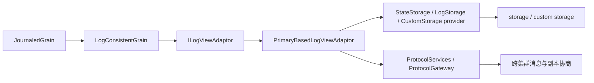

# Event Sourcing 与 Log Consistency：Orleans 里这条“历史分支”到底怎么跑（第三十四篇）

先把结论说直白一点：`Orleans.EventSourcing` 不是一套“顺手挂在 grain 上的小功能”，而是一整条独立的状态一致性线。它的核心不是普通的请求调度，而是把 grain 的状态当成“可回放、可确认、可同步”的日志视图来管。`JournaledGrain` 只是最常用的入口，真正的骨架在 `LogConsistentGrain` 和一组 `ILogViewAdaptor` 实现里。

如果你要重建一版，我会这样判断：

1. 语义上可以继承：事件追加、确认、回放、 tentative/confirmed 双视图、跨集群同步。
2. 抽象上应该重写：不要保留现在这种“base class + provider + protocol services + 多套 adaptor”的历史堆叠。
3. 实现上不要照抄：`StateStorage`、`LogStorage`、`CustomStorage` 三套 provider 本质上是同一条模板的不同落地。

它和主线 grain/runtime 最大的不同，不在于“也是个 grain”，而在于它在做另一层事：主线 runtime 负责消息到达和 turn 调度，这条线负责状态怎么被写成日志、怎么确认、怎么回放、怎么跨副本收敛。

## 主链

这条链路可以粗暴地理解成：

真正跑起来时，用户代码一般是这样写的：

1. 继承 `JournaledGrain<TState, TEventBase>`。
2. 调用 `RaiseEvent` 或 `RaiseEvents` 追加事件。
3. 调用 `ConfirmEvents()` 等待确认，或者用 `RefreshNow()` 强制同步。
4. `ApplyEvent` 把事件折叠到状态上。
5. `LogViewAdaptor` 负责把“待提交事件”变成“已确认日志前缀”，并在必要时发通知、重试、回读。

这条链路里最重要的不是“写入一个状态对象”，而是“让状态变化变成一个可确认的序列”。这就是 event sourcing 和 log consistency 的交界点。

## 关键组件

### `JournaledGrain`

[`src/Orleans.EventSourcing/JournaledGrain.cs`](/Users/zhaoyiqi/Code/orleans/src/Orleans.EventSourcing/JournaledGrain.cs) 是最常见的入口。它把 API 直接翻译成 event sourcing 语言：

- `RaiseEvent` / `RaiseEvents`：追加事件。
- `RaiseConditionalEvent` / `RaiseConditionalEvents`：带冲突检测地追加。
- `ConfirmEvents`：等之前提交的事件真正进入 confirmed prefix。
- `RefreshNow`：先同步最新确认状态，再继续读。
- `State` 和 `TentativeState`：确认态和暂态分开看。

它自己不保存事件，也不管 storage 细节，只负责把“事件驱动的状态模型”暴露给业务。

### `LogConsistentGrain`

[`src/Orleans.EventSourcing/LogConsistency/LogConsistentGrain.cs`](/Users/zhaoyiqi/Code/orleans/src/Orleans.EventSourcing/LogConsistency/LogConsistentGrain.cs) 是更底层的 base class。它做了三件事：

- 在 activation 生命周期里安装 adaptor。
- 从 `LogConsistencyProviderAttribute` 或默认 provider 里挑一个 `ILogViewAdaptorFactory`。
- 给 adaptor 准备 `IGrainStorage`、`ILogConsistencyProtocolServices` 和初始 state。

它的问题也从这里开始：这个类已经不只是“基类”了，它还是配置入口、服务装配器和协议引导器。

### `ILogViewAdaptor` 和 `PrimaryBasedLogViewAdaptor`

[`src/Orleans.EventSourcing/LogConsistency/ILogViewAdaptor.cs`](/Users/zhaoyiqi/Code/orleans/src/Orleans.EventSourcing/LogConsistency/ILogViewAdaptor.cs) 定义了这套系统最核心的抽象：

- `TentativeView`
- `ConfirmedView`
- `ConfirmedVersion`
- `Submit`
- `TryAppend`
- `ConfirmSubmittedEntries`
- `Synchronize`

[`src/Orleans.EventSourcing/Common/PrimaryBasedLogViewAdaptor.cs`](/Users/zhaoyiqi/Code/orleans/src/Orleans.EventSourcing/Common/PrimaryBasedLogViewAdaptor.cs) 是公共模板。它的思路很清楚：

- 日志本身不一定完整保存。
- 只要维护最新 view、版本号、写标记和必要的元数据就够了。
- 写主路径是串行的。
- 失败后要能回读、重试、再判断刚才那次写到底成没成功。

也就是说，这里不是“简单存一份对象”，而是一个带回放、确认、通知和冲突恢复的 journal 机。

### 三套 provider

当前仓库里，event sourcing 的落地分成三套：

- [`src/Orleans.EventSourcing/StateStorage/LogConsistencyProvider.cs`](/Users/zhaoyiqi/Code/orleans/src/Orleans.EventSourcing/StateStorage/LogConsistencyProvider.cs)
- [`src/Orleans.EventSourcing/LogStorage/LogConsistencyProvider.cs`](/Users/zhaoyiqi/Code/orleans/src/Orleans.EventSourcing/LogStorage/LogConsistencyProvider.cs)
- [`src/Orleans.EventSourcing/CustomStorage/LogConsistencyProvider.cs`](/Users/zhaoyiqi/Code/orleans/src/Orleans.EventSourcing/CustomStorage/LogConsistencyProvider.cs)

它们的共同点是都返回 `ILogViewAdaptor<TView, TEntry>`，差别只是 primary 到底落在哪里：

- `StateStorage`：走标准 `IGrainStorage`。
- `LogStorage`：同样走存储，但语义上更偏日志视图。
- `CustomStorage`：让 grain 自己实现 `ICustomStorageInterface<TState, TDelta>`，把读写逻辑交给业务代码。

这说明 Orleans 在这里采取的是“同一套协议，多个后端”的路子，而不是再发明一套完全不同的持久化模型。

### 协议服务和跨集群桥

[`src/Orleans.EventSourcing/LogConsistency/ILogConsistencyProtocolServices.cs`](/Users/zhaoyiqi/Code/orleans/src/Orleans.EventSourcing/LogConsistency/ILogConsistencyProtocolServices.cs) 和 [`src/Orleans.Runtime/LogConsistency/ProtocolServices.cs`](/Users/zhaoyiqi/Code/orleans/src/Orleans.Runtime/LogConsistency/ProtocolServices.cs) 是这条线和 runtime 之间最明显的桥。

它给 adaptor 的能力很直接：

- 拿到当前 grain 的 `GrainId`。
- 深拷贝对象。
- 打日志。
- 上报 protocol error。
- 区分用户代码异常和协议异常。

再往上看，[`src/Orleans.EventSourcing/LogConsistency/ILogConsistencyProtocolGateway.cs`](/Users/zhaoyiqi/Code/orleans/src/Orleans.EventSourcing/LogConsistency/ILogConsistencyProtocolGateway.cs) 说明这套机制还考虑了跨集群 relay。也就是说，它不是只做单节点 event sourcing，而是想把副本间协商也包进去。

### Grain 标记和宿主装配

[`LogConsistencyProviderAttribute`](/Users/zhaoyiqi/Code/orleans/src/Orleans.Core.Abstractions/Providers/ProviderGrainAttributes.cs) 是 grain 侧的选择开关。`LogConsistentGrain` 会反射它，然后从 DI 里取对应的 keyed provider。拿不到就回退默认 provider。

宿主侧则是几组 builder extension：

- [`src/Orleans.EventSourcing/Hosting/StateStorageSiloBuilderExtensions.cs`](/Users/zhaoyiqi/Code/orleans/src/Orleans.EventSourcing/Hosting/StateStorageSiloBuilderExtensions.cs)
- [`src/Orleans.EventSourcing/Hosting/LogStorageSiloBuilderExtensions.cs`](/Users/zhaoyiqi/Code/orleans/src/Orleans.EventSourcing/Hosting/LogStorageSiloBuilderExtensions.cs)
- [`src/Orleans.EventSourcing/Hosting/CustomStorageSiloBuilderExtensions.cs`](/Users/zhaoyiqi/Code/orleans/src/Orleans.EventSourcing/Hosting/CustomStorageSiloBuilderExtensions.cs)

这说明它已经不是实验性样例，而是一条能在 silo 装配阶段明确挂上的正式能力线。

### `Orleans.Journaling`

这部分和 event sourcing 同属“日志/回放”思路，但不是同一个抽象。

[`src/Orleans.Journaling/DurableGrain.cs`](/Users/zhaoyiqi/Code/orleans/src/Orleans.Journaling/DurableGrain.cs) 提供的是另一种 grain 基类；[`src/Orleans.Journaling/StateMachineManager.cs`](/Users/zhaoyiqi/Code/orleans/src/Orleans.Journaling/StateMachineManager.cs) 则是一个管理多状态机、写日志、拍 snapshot、恢复回放的 manager。

它更像“grain 内部自己养一组 durable state machine”，而不是 event sourcing 那种“单个 grain 的事件日志视图”。两者都像 journal，但一个偏 grain 语义，一个偏状态机语义。

## 在仓库里的位置和成熟度

这套能力在当前仓库里不是边角料。证据很直接：

- 有完整包：`Microsoft.Orleans.EventSourcing`。
- 有 README 和样例。
- 有 runtime 侧 protocol services。
- 有三套 provider。
- 有 lifecycle 集成。
- 有 diagnostics 接口。

所以它不是“临时拼出来的 demo”。但它也不是主线 runtime 的核心路径，更像一条成熟的旁路能力：能用、能扩展、历史包袱也明显。

如果把 Orleans 主线理解成“message -> activation -> turn -> response”，那 Event Sourcing 这条线就是“event -> log view -> confirm -> sync -> replicate”。两条线的关注点完全不同。

## 架构上不够干净的地方

这部分是我最想提醒的，因为你要重建的话，最好别原样带走。

1. `LogConsistentGrain` 责任太多。
   它既负责基类语义，又负责 provider 选择、依赖装配、生命周期挂接，边界不干净。

2. 三套 provider 的模板感太强。
   `StateStorage`、`LogStorage`、`CustomStorage` 共享了几乎一样的主链，只是后端不同。现在这种拆法能适配历史需求，但抽象层次不够纯。

3. `PrimaryBasedLogViewAdaptor` 太像“总模板”。
   它把写入、确认、通知、失败回读、重试、版本判断都塞在一层里，容易变成复杂度中心。

4. `ProtocolServices` 是 runtime 细节的泄漏口。
   它把 grain 上下文、日志、深拷贝、集群 id 全打包给协议层，本质上是在给一条历史抽象让路。

5. `CustomStorage` 是很典型的历史折中。
   它把协议直接交给业务实现，灵活，但也让一致性责任往下沉，重建时最好把这类“任意自定义读写”收窄成更清晰的接口。

6. 命名上混了三套语义。
   `event sourcing`、`log consistency`、`replicated state`、`journal` 这几个词在仓库里是交叉出现的，但它们不是完全一样的东西。现在的组织方式更多是“历史上怎么演进就怎么留”，不是“概念上先分清再实现”。

## 如果要重建，我会怎么摘

我会只拿这几样：

- `JournaledGrain` 的外部语义：`RaiseEvent`、`ConfirmEvents`、`RefreshNow`、`TentativeState`、`State`。
- `ILogViewAdaptor` 的双视图语义：confirmed / tentative。
- 一套清楚的 journal replication 协议。
- 一套清楚的 storage backend 接口。
- 一套最小的跨集群同步桥。

我不会直接继承现在这层：

- 不要把 provider 选择藏进基类反射里。
- 不要把三套 provider 的差异靠复制粘贴维护。
- 不要让 adaptor 既像 repository 又像 protocol engine。
- 不要把 runtime 服务对象当成给协议层兜底的万能袋子。

## 推荐阅读顺序

如果你是按源码往下啃，我建议这么看：

1. [`src/Orleans.EventSourcing/README.md`](/Users/zhaoyiqi/Code/orleans/src/Orleans.EventSourcing/README.md)
2. [`src/Orleans.EventSourcing/JournaledGrain.cs`](/Users/zhaoyiqi/Code/orleans/src/Orleans.EventSourcing/JournaledGrain.cs)
3. [`src/Orleans.EventSourcing/LogConsistency/LogConsistentGrain.cs`](/Users/zhaoyiqi/Code/orleans/src/Orleans.EventSourcing/LogConsistency/LogConsistentGrain.cs)
4. [`src/Orleans.EventSourcing/LogConsistency/ILogViewAdaptor.cs`](/Users/zhaoyiqi/Code/orleans/src/Orleans.EventSourcing/LogConsistency/ILogViewAdaptor.cs)
5. [`src/Orleans.EventSourcing/Common/PrimaryBasedLogViewAdaptor.cs`](/Users/zhaoyiqi/Code/orleans/src/Orleans.EventSourcing/Common/PrimaryBasedLogViewAdaptor.cs)
6. [`src/Orleans.EventSourcing/StateStorage/LogConsistencyProvider.cs`](/Users/zhaoyiqi/Code/orleans/src/Orleans.EventSourcing/StateStorage/LogConsistencyProvider.cs)
7. [`src/Orleans.EventSourcing/CustomStorage/LogConsistencyProvider.cs`](/Users/zhaoyiqi/Code/orleans/src/Orleans.EventSourcing/CustomStorage/LogConsistencyProvider.cs)
8. [`src/Orleans.Runtime/LogConsistency/ProtocolServices.cs`](/Users/zhaoyiqi/Code/orleans/src/Orleans.Runtime/LogConsistency/ProtocolServices.cs)
9. [`src/Orleans.Journaling/StateMachineManager.cs`](/Users/zhaoyiqi/Code/orleans/src/Orleans.Journaling/StateMachineManager.cs)

这篇写完之后，Event Sourcing 和 Journaling 的边界就基本清楚了：前者是 grain 语义下的事件日志一致性，后者是状态机语义下的持久日志管理。它们能互相借鉴，但不该直接揉成一团。
