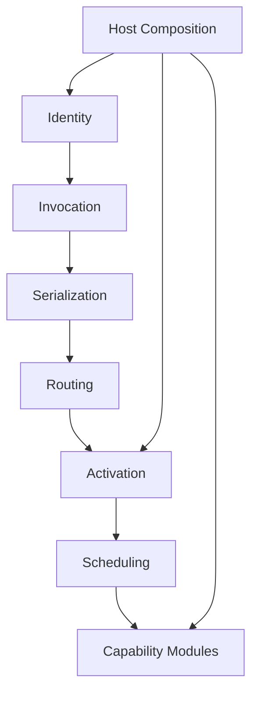

# 复刻设计总纲：如果重建一版 Orleans，应该怎么切（第三十八篇）

这一篇不再是“读源码时怎么记笔记”。

它是给“我要重新做一版 Orleans”准备的架构蓝图。前面 1 到 37 篇已经把 Orleans 的主干、能力层、历史包袱和工程现实拆得差不多了，这一篇只回答一件事：

> 如果不复刻 Orleans 的现有形状，只吸收它已经被证明有效的语义内核，新系统应该长什么样。

我先把立场说死：

- 不是复制 Orleans，而是提炼 Orleans。
- 不是把所有成熟能力一股脑搬过去，而是先把边界切干净。
- 不是沿着历史演化路径往前拷，而是直接按新系统的抽象来重构。
- 最终目标不是“像”，而是“更清楚、更稳、更容易继续长大”。

这篇会尽量讲得硬一点。因为如果一开始就讲太软，最后很容易又滑回 Orleans 现在那种“能用，但层次不够干净”的状态。

---

## 1. 设计目标

如果我要重建，我会把目标压成 5 条。

### 1.1 语义继承，不继承形状

必须继承的，是 Orleans 已经被证明可靠的语义：

- 强类型引用
- 异步消息调用
- activation 作为执行边界
- turn-based 调度
- 编译期生成代理和序列化元数据
- 按宿主生命周期组合 runtime

不要继承的，是它今天长出来的那些实现形状：

- 总装配式默认注册
- 运行时大量扫描和猜测
- 兼容老版本时留下的分叉
- 把太多职责压进一个核心对象里

### 1.2 内核先干净，再谈功能全

第一版最重要的不是功能数，而是边界。

我宁愿第一版少几个能力，也不要一开始就把：

- membership
- placement
- gateway
- streams
- transactions
- multi-cluster

全部混成一锅。

原因很简单。你一旦把这些东西和最小调用链绑死，后面就很难重构了。

### 1.3 运行时少猜，编译期多做

Orleans 这几年的成熟经验很明确：越多东西能在编译期落地，运行时就越稳。

所以新系统应该尽量坚持：

- 编译期生成代理、invokable、serializer、manifest
- 运行时只消费显式登记过的元数据
- 不把“扫描得到什么就用什么”当成默认策略

### 1.4 所有边界都要可见

这个要求听起来普通，但其实很关键。

你应该能从代码结构里一眼看出：

- 谁负责 identity
- 谁负责 invocation
- 谁负责 serialization
- 谁负责 activation
- 谁负责 routing
- 谁负责 cluster
- 谁负责 capability
- 谁负责 host composition

如果边界看不出来，后面再多写文档也没用。

### 1.5 默认先支持单集群内核

一开始只做单集群内核，不做“从第一天起就全球分布式”。

这样不是保守，而是为了把核心做实：

- 一台机器先跑通
- 多个节点再接入
- 再往上叠 gateway、placement、membership、recovery

顺序不能反。

---

## 2. 非目标

这部分我会写得更直接一点。

### 2.1 不是 Orleans 兼容实现

新系统不需要对齐：

- 老接口签名
- 老 serializer 格式
- 老 grain id 兼容
- 老 provider 发现方式
- 老生命周期细节

如果要兼容，那是后续适配层的事情，不该污染内核。

### 2.2 不是“默认把所有能力都放进核心”

核心只放那些不放就没法成立的东西。

像下面这些，应该放在 capability layer，而不是 core：

- persistent state
- timer / reminder
- streaming
- transaction
- diagnostics
- security
- multi-cluster

### 2.3 不是围绕旧目录结构重建

我不会先问“`src/Orleans.Core` 该怎么对应”。

应该先问：

- 什么是 runtime 的最小闭环
- 什么是编译期闭环
- 什么是协议闭环
- 什么是宿主闭环

目录是后果，不是起点。

---

## 3. 分层与模块边界

如果重建，我会把系统切成 8 层。每层只回答一个问题。



### 3.1 Identity Layer

只负责“这是谁”。

它应该定义：

- actor / grain 的稳定身份
- interface 类型
- 版本信息
- key 编码

这一层不要碰消息、不要碰路由、不要碰调度。

### 3.2 Invocation Layer

只负责“怎么发起一次调用”。

它应该把：

- 强类型代理
- `IInvokable`
- 调用参数
- 返回值
- 异常

统一成一个调用协议对象。

这一层不该知道 transport 细节。

### 3.3 Serialization Layer

只负责“怎么把调用协议和普通对象变成 wire format”。

这里应该有：

- codec
- copier
- activator
- type manifest
- message serializer

这一层不应该自己决定路由。

### 3.4 Routing Layer

只负责“这次调用该去哪里”。

这里应该包含：

- activation 查找
- placement 决策
- directory
- gateway 选择
- 本地/远端转发

这一层不应该关心业务对象怎么序列化。

### 3.5 Activation Layer

只负责“一个 activation 怎么被创建、保存、挂起、销毁”。

activation 是运行时边界，不是纯粹对象池。

### 3.6 Scheduling Layer

只负责“同一个 activation 上的调用怎么排队执行”。

这一层必须把 turn-based 语义讲清楚。

### 3.7 Capability Modules

把所有可插拔能力收在这里：

- state store
- timer / reminder
- streams
- transaction
- diagnostics
- security
- management

核心 runtime 不应该直接依赖这些模块的内部细节。

### 3.8 Host Composition

只负责“怎么把整套东西启动起来”。

这里应该只有三件事：

- 构建 runtime graph
- 装配模块
- 挂生命周期

如果这一层开始负责业务逻辑，系统就会重新变脏。

---

## 4. 最小内核

如果我真要先做一个能跑的版本，最小内核只保留 6 个东西。

### 4.1 稳定身份

必须有：

- actor id
- interface id
- key 编码规则
- 可打印、可比较、可持久化的表示

### 4.2 强类型调用

必须有：

- proxy
- invokable
- invocation envelope
- response completion

### 4.3 统一消息协议

必须有：

- header
- body
- request context
- message kind

### 4.4 单机 activation

必须有：

- activation 创建
- activation 缓存
- activation mailbox
- activation 销毁

### 4.5 turn scheduler

必须有：

- 默认串行执行
- 有限 interleaving
- 可控 reentrancy

### 4.6 host 和 module system

必须有：

- runtime builder
- lifecycle
- module registration
- in-memory transport

如果这 6 件事没跑通，后面的 cluster、streaming、state、timer 都只是空谈。

---

## 5. 我会怎么建议抽象接口

下面这些不是要照着 Orleans 原样抄，而是我会建议新系统里先保住的接口边界。

### 5.1 Identity

```csharp
interface IActorId { }
interface IActorType { }
interface IInterfaceType { }
interface IActorReference { }
interface IKeyCodec { }
```

### 5.2 Invocation

```csharp
interface IProxyFactory { }
interface IInvokable { }
interface IInvocationEnvelope { }
interface IInvocationDispatcher { }
interface IResponseSource { }
```

### 5.3 Serialization

```csharp
interface ICodec<T> { }
interface ITypeManifest { }
interface ITypeResolver { }
interface IMessageSerializer { }
interface IObjectCopier { }
```

### 5.4 Activation and scheduling

```csharp
interface IActivation { }
interface IActivationMailbox { }
interface IActivationScheduler { }
interface IActivationFactory { }
interface IActivationRegistry { }
```

### 5.5 Routing and cluster

```csharp
interface IRoutingTable { }
interface IPlacementPolicy { }
interface ITopologyView { }
interface INodeMembership { }
interface ITransport { }
```

### 5.6 Capability modules

```csharp
interface IStateStore { }
interface ITimerScheduler { }
interface IReminderStore { }
interface IStreamProvider { }
interface ISecurityModule { }
```

### 5.7 Host composition

```csharp
interface IRuntimeModule { }
interface IRuntimeBuilder { }
interface IRuntimeHost { }
interface ILifecycle { }
```

我刻意把接口名写得比较直。

原因也很简单：第一版最怕的不是少抽象，而是抽象太多、太早、太散。

---

## 6. 阶段性里程碑

如果按工程推进，我会把重建拆成 4 期。

### 6.1 第一阶段：单进程内核

目标：

- 跑通一次强类型调用
- 序列化和反序列化闭环
- activation 创建和销毁闭环
- 调度闭环

验收标准：

- 一个 grain 能被代理调用
- 返回值能回来
- 异常能原样传回
- 不依赖集群

### 6.2 第二阶段：单集群运行

目标：

- 加入 routing
- 加入 directory
- 加入 placement
- 加入最小 membership

验收标准：

- 调用能跨 node 到达目标 activation
- 激活丢失后能重新找到
- 节点上下线不会把内核打碎

### 6.3 第三阶段：能力模块

目标：

- state
- timer
- reminder
- diagnostics
- security

验收标准：

- 这些模块不侵入 core
- 模块能独立启停
- 不需要改调用主链

### 6.4 第四阶段：分布式演进

目标：

- streaming
- transaction
- rolling upgrade
- multi-cluster
- version compatibility

验收标准：

- 新能力通过扩展层接入
- core 不改或者少改
- 旧部署能逐步迁移

---

## 7. 哪些能力要延期

这部分我建议非常明确。

### 7.1 延后到第二阶段以后

- transaction
- streaming
- multi-cluster
- rolling upgrade
- heterogeneous cluster

### 7.2 延后到能力层以后

- persistent state
- reminder
- diagnostics
- security
- management plane

### 7.3 延后到兼容层以后

- legacy codegen support
- old serializer fallback
- old grain id grammar
- old interface metadata compatibility

### 7.4 基本不该进第一版核心

- provider 自动发现
- 大量 attribute 驱动的隐式装配
- 复杂的默认服务总表
- 为兼容历史行为留下的特殊分支

---

## 8. 和 Orleans 原版最关键的取舍差异

这一段最重要。因为真正的差异不在“功能清单”，而在“默认心智”。

### 8.1 Orleans 是演化出来的，你是设计出来的

Orleans 的很多层次是沿着历史一步步长出来的。

你不需要复制这个过程。你可以直接把清楚的边界先定下来。

### 8.2 Orleans 的默认注册偏总装配，你应该偏显式模块

Orleans 今天能跑，是因为默认注册帮它兜住了很多事。

但如果你重建，我会希望它更像：

- core module
- routing module
- serializer module
- activation module
- capability modules

而不是一张越来越大的默认注册表。

### 8.3 Orleans 运行时容忍很多猜测，你应该尽量减少猜测

你已经在前面的源码里看过很多这种痕迹：

- 扫描
- 推断
- fallback
- 特例

新系统应该尽量把这些迁到编译期，或者变成显式配置。

### 8.4 Orleans 需要兼容旧世界，你不需要马上兼容

这是最大的自由。

因为你不必为了“不能破坏现有用户”去保留那些不够干净的接口和协议。

### 8.5 Orleans 的复杂度中心已经很清楚，你应该故意拆开

Orleans 里的复杂度中心，我的判断是：

- `ActivationData`
- 默认服务装配
- 运行时序列化和兼容层
- directory / placement / gateway 的交织

重建时，这些地方都应该被拆散。

不是“换名字继续放一起”，而是真的拆成不同层。

---

## 9. 最后一句话

如果你要重建一版 Orleans，我建议你的策略不是“学得尽量像”，而是：

- 先把强类型引用、调用协议、序列化、activation、调度这条主链做成干净内核
- 再把 cluster、state、timer、stream、transaction 当作后续模块接上去
- 最后才考虑兼容、迁移和历史包袱

这样做出来的东西，可能不会像 Orleans 现在这样“什么都有”。

但它会更像一个真正能继续长十年的新系统。
